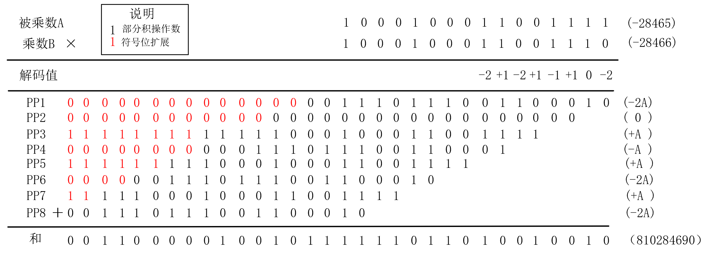
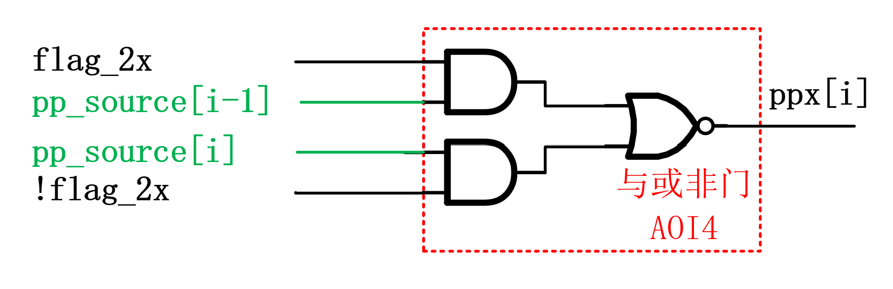
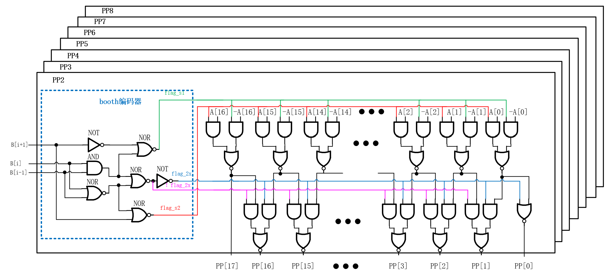
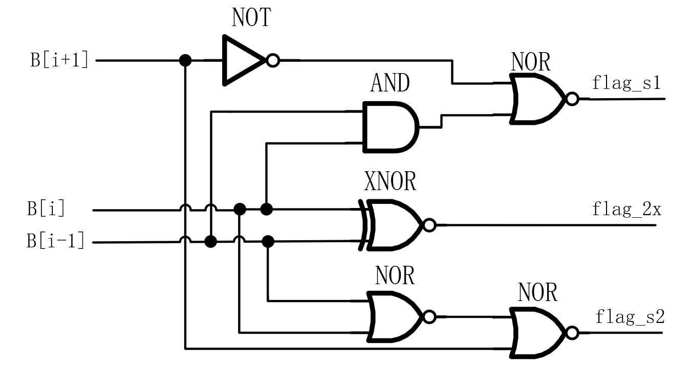

### 概述

本项目实现了一个计算16bit有符号数*16bit有符号数的高效定点乘法器，使用verilog硬件描述语言进行部署。乘法器输入的被乘数`A_NUM`和乘数`B_NUM`均为16bit定点有符号数，输出为32bit有符号数据。采用Radix-4 Booth算法进行乘数编码，并依据乘数编码生成对应的部分积，接着采用Wallace tree对生成的部分积进行压缩，最后通过一个特殊的32bit加法器将Wallace tree压缩得到的两个部分积进行相加，即得到最终需要的32bit有符号补码数据`C_NUM`。

### 基本原理

本项目乘法器的实现采用了Radix-4 Booth乘数编码算法+Wallace tree方案，其基本原理如下，为了方便公式书写，下文将`A_NUM`、`B_NUM`、`C_NUM`分别简写为`A`、`B`、`C`。

#### Radix-4 Booth算法原理

Radix-4 Booth乘数编码算法是一种可以减少部分积项数的算法方案，对于一个n位二进制补码数据`B`，其十进制真实值$B_{D}$为：

$$B_{D}=-1 \times B[n-1] \times 2^{n-1}+\sum_{i=0}^{n-2}B[i] \times 2^i \tag{1}$$
$$
B_{D}=-1 \times B[n-1] \times 2^{n-1}+\sum_{i=0}^{n-2}B[i] \times 2^i \tag{1}
$$

式(1)中， $B[i]$ 代表数据`B`的第i位上的值。

对于本项目乘法器输入的16位乘数,代入式(1)，则乘数可以表示为：

$$\begin{align}
B_{D} &= -B[15]2^{15}+B[14]2^{14}+ \cdots +B[0]2^{0} \\
&= (-2B[15]+B[14]+B[13])2^{14} + (-2B[13]+B[12]+B[11])2^{12}+ \cdots + (-2B[1]+B[0]+B[-1])2^{0}\tag{2}
\end{align}$$
$$
\begin{align}
B_{D} &= -B[15]2^{15}+B[14]2^{14}+ \cdots +B[0]2^{0} \\
&= (-2B[15]+B[14]+B[13])2^{14} + (-2B[13]+B[12]+B[11])2^{12}+ \cdots + (-2B[1]+B[0]+B[-1])2^{0}\tag{2}
\end{align}
$$

被乘数`B`可以使(2)式来表达，其中B[-1]代表补充的乘数`B`的第"-1"位，约定这一位为0。将被乘数数据的相邻的三位比特位`B[i]`、`B[i]`、`B[i-1]`视为一个整体，则(2)式与(1)式相比，将2的幂次项从16个减少到8个，则`A`与`B`相乘后的部分积项数也从16个减少到8个，这有利于减少后面为处理部分积而使用的电路资源开销。

Radix-4 Booth编码与所对应的部分积操作之间的对应关系如表1所示，从表中可知，Radix-4 Booth编码方案对被乘数`A`的操作一共有五大类，即生成`0`、`+A`、`+2A`、`-A`、`-2A`。其中，`0`是确定数`16'h0000` ，`+A`就是乘法器的输入，`+2A`直接由输入的`+A`数据左移一位得到，只需要通过电路资源生成一个`-A`操作数，并将`-A`左移一位即可得到`-2A`，逻辑资源开销较小，适合于硬件电路实现。

表1. Radix-4 Booth乘数编码与部分积操作对照表

$$
\begin{array}{|c|c|c|}
\hline
{\{B_{i+1},B_{i},B_{i-1}\}}&{-2B_{i+1}+B_{i}+B_{i-1}}&{部分积操作}\\
\hline
{000}&{0}&{0}\\
\hline
{001}&{+1}&{A}\\
\hline
{010}&{+1}&{A}\\
\hline
{011}&{+2}&{2A}\\
\hline
{100}&{-2}&{-2A}\\
\hline
{101}&{-1}&{-A}\\
\hline
{110}&{-1}&{-A}\\
\hline
{111}&{0}&{0}\\
\hline
\end{array}
$$

举例来说，对于一个16bit*16bit有符号数的计算，假设被乘数`B`为16'b1000_1000_1100_1110，乘数`A`为16'b1000_1000_1100_1111，首先对乘数进行分段booth解码，分段解码的过程如图1所示。

图1. Radix-4 Booth算法分段解码过程示例

完成booth分段解码后，依据解码值选择相应的booth部分积操作数，Radix-4 Booth算法的竖式运算示意图如图2所示，图2中PP代表部分积(partial product),每个pp的操作数都是17bit，因为`-2A`、`2A`都需要17bit来表示。图2中红色部分代表原始数据左移之后在LSB补的0，绿色部分代表符号位扩展的位置。Radix-4 Booth乘法与传统的竖式乘法相比，每进行一位乘法计算，部分积操作数向左移动两位，而不是一位，这是由于(2)式中，相邻的2的幂次项的指数部分相差2，而在(1)式中指数部分相差1。

图2. Radix-4 Booth竖式乘法运算过程示例

#### wallace乘法器基本原理

wallce乘法器是一种使用全加器、半加器等模块，将原来多个部分积进行压缩，最终输出两个部分积的一种乘法器结构，wallace乘法器减少了部分积的个数，使得乘法器可以使用更少的加法器来累加部分积，减小了由于乘法器级联而带来的较大的延时。

本设计所用的wallace树的结构如图3所示，本设计使用两级4:2压缩，共计3个4:2压缩器来得到最终的两个部分积`PPC2_1`、`PPC2_2`，最后通过32bit加法器对得到的`PPC2_1`、`PPC2_2`求和，即可得到乘积结果。

图3. wallace压缩树

常用的部分积压缩方案有4:2压缩和3:2压缩，3:2压缩模块输入3个部分积的比特位，最终输出压缩后的两个部分积的比特位，本设计中3:2压缩模块实质上就是一个全加器，其电路结构如图4所示。

图4. 全加器/3:2压缩模块门级电路结构

4:2压缩输入4个部分积比特位以及来自上一级压缩器的进位信号(如果存在)，最终生成2个压缩后的部分积比特位，其结构如图5所示，从图中可知，其进位输出`co`与进位输入`ci`无关，只要当`i0`、`i1`、`i2`确定，`co`输出就确定，不会造成进位链的传播。4:2压缩模块一共有5个有效输入信号，得到3个输出，本设计所采用的4:2压缩器的结构使用两个3:2压缩器级联得到，其电路资源开销等于两个3:2压缩模块的资源开销。

图5. 4:2压缩模块门级电路结构

Radix-4 Booth算法得到的部分积矩阵图如图6所示，图6中黑点代表部分积原始操作数(Radix-4 Booth编码方案得到的`0`、`A`、`-A`、`2A`及`-2A`)，红点代表有符号数的符号扩展位，`PP1`-`PP8`依此代表由Radix-4 Booth算法得到的部分积1到部分积8，`PPC1_1`-`PPC1_4`代表wallace压缩时第一级压缩后产生的4个部分积，`PPC2_1`、`PPC2_2`代表wallace压缩后最终得到的两个部分积。

在本设计中，对不同权值位的压缩过程，使用了不同的模块来进行"4:2压缩"，具体到进行部分积压缩的每一位来说，图6中绿色框框住的位置使用标准的4:2压缩模块，红色线框框住的几个部分积的比特位使用3:2压缩模块，这些位置上的有效数据只有三个，使用3:2压缩器即可将部分积压缩到两个，相比于使用4:2压缩，这一设计减少了电路逻辑资源开销。

图6. Radix-4 Booth算法得到的部分积压缩过程示意图

### 设计详解

本设计整体结构可以分为3大部分，分别是：

- 部分积操作数生成
- 部分积压缩
- 部分积的求和

本章将对三大部分的设计细节进行解释和说明。

#### 部分积操作数生成

本设计中，部分积生成模块`boot2_pp_gen`输入数据为16bit的被乘数`A_NUM`和乘数`B_NUM`，输出8个Radix-4 Booth乘数编码算法产生的部分积操作数`PP1`-`PP8`，输出的每个部分积都是17bit数据。

##### 问题分析

分析部分积生成过程，发现其中存在着如下的规律：

1. Radix-4 Booth编码方案需要得到`0`、`A`、`-A`、`2A`及`-2A`一共五种17bit部分积操作数，每一个部分积操作数是17bit的。通过观察这五类数据的规律，可以发现：

   1. `A`、`-A`使用16位表示就已足够，这两个操作数的最高位与次高位相同，`2A`、`-2A`的最低位一定是0。如果将`A`、`-A`放在一起处理，只需要处理低16位数据，将`2A`、`-2A`放在一起处理，也无需考虑最低位的生成，且当`2A`、`-2A`不考虑最低位时，实际上就是16bit的`A`、`-A`。以上部分积操作数`ppx`的最高位和次高位的数据特殊性，使得部分积操作数`ppx`的最高位和次高位的生成，相比于中间位置的数据生成，可以使用更为简单的电路实现。

   2. `2A`可以由`A`左移一位得到，`-2A`可以由`-A`左移一位得到，而`A`直接由输入得到，因此，对于5类部分积操作数，只需要通过额外的电路计算`-A`，就能得到全部的5类部分积操作数。由于8个部分积操作数的生成过程都有可能用到`-A`信号，因此，可以设计一个专用的计算`-A`的电路模块`inv_converter_16`，其计算的结果作为中间数据，分为多路传给部分积操作数解码模块`pp_decoder`。

2. Radix-4 Booth编码方案中，对于第一个部分积操作数的生成，乘数编码的最低位(`B[-1]`)一定是0，相比其他位置的乘数编码，可以使用专用的解码电路实现Booth译码，减少了电路逻辑资源开销。

##### -A计算模块设计

由上述规律1.2，需要设计一个电路来得到16bit数据源`-A`，从`A`到`-A`，在补码操作上就是“按位取反，末位加1”的过程。加1的过程使用专门的加法器，即有一个输入数据为16'b0000_0000_0000_0001的加法器电路。

##### 操作数生成模块设计

综合规律1.1及1.2，对于一个部分积操作数`ppx`，其数据来源有三种，即`A`、`-A`、`0`，另外两个部分积操作数`2A`、`-2A`都是这些数据源的变体。本设计使用两个标志信号`flag_s1`、`flag_s2`的组合来选择数据来源`pp_source`，接着通过`flag_2x`标志信号确定数据源是否需要左移操作，以生成最终的17bit部分积操作数`ppx`。

三个标志信号与相应的部分积操作的对应关系如表2所示。

表2. 标志信号与部分积操作数对应表

$$
\begin{array}{|c|c|c|c|}
\hline
{部分积操作数}&{flag\_2x}&{flag\_s1}&{flag\_s2}\\
\hline
{A}&{0}&{0}&{1}\\
\hline
{-A}&{0}&{1}&{0}\\
\hline
{2A}&{1}&{0}&{1}\\
\hline
{-2A}&{1}&{1}&{0}\\
\hline
{0}&{X}&{1}&{0}\\
\hline
\end{array}
$$

本设计中,选择数据源`A`、`-A`、`0`的电路结构如图7所示，该电路实际上是一个”与或非门”，其输入的标志信号`flag_s1`、`flag_s2`与输出的部分积操作数数据源`pp_source`的对应关系如表3所示。

图7. 部分积操作数数据源生成电路

注意：这一数据源选择电路输出的数据源`pp_source`实际上不是`A`、`-A`、`0`的原始数据，而是这些数据按位取反后的数据。后续电路将直接利用这个取反后的数据，以达到节省电路资源的目的，这一内容将在下文讲解。

表3. 标志信号与部分积数据源对应表

$$
\begin{array}{|c|c|c|}
\hline
{部分积操作数数据源}&{flag\_s1}&{flag\_s2}\\
\hline
{A}&{0}&{1}\\
\hline
{-A}&{1}&{0}\\
\hline
{0}&{0}&{0}\\
\hline
\end{array}
$$

 当部分积操作数数据源确定后，对于有特定数据的数据源（`A`、`-A`），下一步需要确定数据源`pp_source`是否需要左移操作，对于输出部分积操作数`ppx`的第`i`位，有两种可能结果：

 - 需要移位的数据，即`pp_source`的第`i-1`位取反后的数据
 - 不需要移位的数据，即`pp_source`的第`i`位取反后的数据

通过`flag_2x`信号来确定输出部分积操作数`ppx`的第`i`位，`ppx[i]`的逻辑表达式如式子(3)所示。

$$ppx[i] = \overline{flag\\_2x \cdot pp\\_source[i-1] +  \overline{flag\\_2x} \cdot pp\\_source[i]} \tag{3}$$
$$
ppx[i] = \overline{flag\_2x \cdot pp\_source[i-1] +  \overline{flag\_2x} \cdot pp\_source[i]} \tag{3}
$$

由表达式可知，这一逻辑表达式在`flag_2x`和`！flag_2x`已经得到的情况下，使用”与或非门”即可实现，其电路结构如图8所示。

图8. 部分积操作数单bit数据数据源选择电路

综上，部分积操作数单bit信号生成模块的门电路结构如图9所示。

图9. 部分积操作数单bit生成模块电路结构示意图

特别地，对于`ppx[0]`，(3)式可以改写为(4)式，使用一个或非门即可实现该数据的计算。

$$\begin{align}
ppx[0] &= \overline{\overline{flag\\_2x} \cdot pp\\_source[0]}\\
&= \overline{flag\\_2x + pp\\_source[0]} \tag{4}
\end{align}$$
$$
\begin{align}
ppx[0] &= \overline{\overline{flag\_2x} \cdot pp\_source[0]}\\
&= \overline{flag\_2x + pp\_source[0]} \tag{4}
\end{align}
$$

而对于`ppx[16]`，由于生成的部分积数据源`pp_source`实际上是16bit的，其17bit数据位是16bit数据位的符号扩展，故而`pp_source[15]`和`pp_source[16]`是一样的数据，因此(3)式可以改写为(5)式，直接使用一个非门即可实现数据输出。

$$\begin{align}
ppx[16] &= \overline{flag\\_2x \cdot pp\\_source[15] +  \overline{flag\\_2x} \cdot pp\\_source[16]}\\
&= \overline{flag\\_2x \cdot pp\\_source[15] +  \overline{flag\\_2x} \cdot pp\\_source[15]} \\
&=\overline{pp\\_source[15]}\tag{5}
\end{align}$$
$$
\begin{align}
ppx[16] &= \overline{flag\_2x \cdot pp\_source[15] +  \overline{flag\_2x} \cdot pp\_source[16]}\\
&= \overline{flag\_2x \cdot pp\_source[15] +  \overline{flag\_2x} \cdot pp\_source[15]} \\
&=\overline{pp\_source[15]}\tag{5}
\end{align}
$$

通过以上分析，一个完整的部分积`ppx`的生成，所用的电路模块如图10所示，将这一模块重复叠加8个，即可得到完整的8个部分积操作数。

图10. 部分积操作数生成模块全局电路示意图

##### booth译码电路

综合表1和表2，可以得到Booth乘数编码与标志信号对照表如表4所示，这也是本设计的booth译码电路的真值表。

表4. Radix-4 Booth乘数编码与标志信号对照表

$$
\begin{array}{|c|c|c|c|}
\hline
{\{B_{i+1},B_{i},B_{i-1}\}}&{flag\_2x}&{flag\_s1}&{flag\_s2}\\
\hline
{000}&{x}&{0}&{0}\\
\hline
{001}&{0}&{0}&{1}\\
\hline
{010}&{0}&{0}&{1}\\
\hline 
{011}&{1}&{0}&{1}\\
\hline
{100}&{1}&{1}&{0}\\
\hline
{101}&{0}&{1}&{0}\\
\hline
{110}&{0}&{1}&{0}\\
\hline
{111}&{x}&{0}&{0}\\
\hline
\end{array}
$$

由表5，可以得到三个标志信号的逻辑表达式分别如(6)-(8)式：

$$flag\\_2x=B_{i+1} \odot B_{i} \tag{6}$$ 
$$
flag\_2x=B_{i+1} \odot B_{i} \tag{6}
$$
$$flag\\_s1=\overline{\overline{B_{i+1}}+B_{i} \cdot B_{i-1}}\tag{7}$$
$$
flag\_s1=\overline{\overline{B_{i+1}}+B_{i} \cdot B_{i-1}}\tag{7}
$$
$$flag\\_s2=\overline{B_{i+1}+\overline {B_{i} + B_{i-1}}}\tag{8}$$
$$
flag\_s2=\overline{B_{i+1}+\overline {B_{i} + B_{i-1}}}\tag{8}
$$
由三个标志信号的逻辑表达式可知，(6)式使用一个同或门产生，(7)式使用一个非门结合一个与或非门产生，(8)式使用两个级联的或非门产生，译码电路的门级结构如图11所示，生成的三类标志信号输入到图9中的部分积操作数生成模块，即可实现Booth乘数编码的译码以及部分积操作数的生成。

图11. 标志信号生成电路

#### 部分积压缩

部分积压缩模块`booth2_pp_compressor`输入8个部分积操作数`pp1`-`pp8`，最终得到两个压缩后的部分积输出`PPout1`和`PPout2`。本设计每一次部分积的压缩均采用"4:2压缩"方案，4：2压缩器的输入4个部分积，得到压缩后的两个部分积。

##### 4:2压缩器整体结构

假设现有4个由booth编码算法生成的4个部分积`pp1`-`pp4`，欲将其输入到“4:2压缩器”得到两个压缩后的部分积`ppc1`、`ppc2`，部分积乘法矩阵图如图12所示，从图中可以观察到如下规律：

图12. Radix-4 Booth算法得到的部分积矩阵图

1. 位置索引为3:0的权位有效的数据输入不到两行，矩阵图空白的地方都是0，在这些权位上，天然就是两个部分积，故而无需额外处理即可作为压缩后部分积的输出。
2. 位置索引为5:4的索引，有效的部分积输入是3个，使用3:2压缩模块即可生成两个压缩后的部分积，这在前文已经提到过。

一次部分积的压缩过程如图13所示，图13中黑色虚线框代表“天然”的两个部分积，无需压缩，直接保留。红色线框圈住的部分代表使用3:2压缩器的位置，绿色线框圈住的部分代表使用4:2压缩器的位置。

对于压缩器模块的输出数据，绿色圆点代表压缩器输出结果保留到本级权重的数据，即图4中和图5中压缩模块的输出数据`d`，蓝色圆点代表压缩器输出结果输出到更高一级权重的数据，即图4中3：2压缩模块的输出数据`co`或者图5中4：2压缩模块的输出数据`c`。

 
图13. 部分积压缩过程示意图

##### 部分积符号位处理

传统的Radix-4 Booth算法得到的部分积矩阵图如图14所示，图中红色圆点代表部分积的符号位扩展，对于某一个特定的部分积`ppx`来说，其红色圆点上的数据都是一样的，即图中同一行的圆点代表的值是一样的，这些扩展位的存在消耗了大量的4:2压缩器资源。

 
图14. 传统Radix-4 Booth乘数编码方案的部分积矩阵

鉴于符号位直接扩展带来的较大的电路资源开销，本设计并未直接采用符号位扩展，而是采用了一种符号位编码方案，现就其原理进行介绍。

假设`pp1`-`pp8`的符号位为 $S_i$ ，其中 $i$ 为1-8，对于图14中的符号位，其值可以表达为(9)式：
$$
\begin{align}
sign &= \sum _{i=1}^{8} S_{i}\sum_{j=2i+15}^{31}2^j \\
&= \sum _{i=1}^{8}[(1-\overline{S_i})(2^{32}-2^{2i+15})] \\
&= \sum _{i=1}^{8}(\overline{S_i} \cdot2^{2i+15}) +10923 \times2^{17} \tag{9}
\end{align}
$$
(9)式中，`10923`为二进制`10101010101011`，相当于在原先产生的部分积的第17、18、20、22、24、26、28、30位补充1，再加上求和符号对应权位的值，可以得到经过符号位编码后的部分积乘法矩阵如图15所示。浅蓝色圆点代表原始数据的符号位及其扩展位，黄色圆点代表符号位经过非门取反后得到的数据，白色圆点代表1bit信号`1`, 在同一行部分积中，蓝色点的值都相同，黄色点数据一定是蓝色点数据经过取反后的数据，注意：不同行的蓝色点、黄色点数据没有关联。

图15. 经过符号位编码后的部分积矩阵

观察图15中编码后的数据，可以发现对于前四个部分积`pp1`-`pp4`，其部分积数据存在以下规律：

- 位置索引6上使用的“4:2压缩模块”可以不考虑进位输入`cin`，因为低一位权位上使用的3:2压缩模块的进位输出`co`不会传播到位置索引6上使用的“4:2压缩模块”，可以设计一个不考虑进位输入的4:2压缩模块`non_cin_4_2_compressor`，其电路结构如图16所示，相比于标准的4:2压缩模块，其电路资源开销变小。

- 位置索引20位置上的“4:2压缩模块”有两个确定的输入，即来自`PP1`的0和来自`PP2`的`1`，为这个确定的输入设计专用的“4:2”压缩模块“，其电路结构如图17所示，相比于标准的4:2压缩模块，其电路资源开销变小。
- 位置索引21上的“4:2压缩模块”实际上只有三个有效输入信号，即来自上级压缩器的进位输入`cin`、来自`pp3`、`pp4`的数据，因此，使用3:2压缩器即可实现原来4:2压缩器的功能，且3:2进位输出信号`co`直接保留到`PPC1_2`,不会造成进位链延长的问题。
- 位置索引22上的“4:2压缩模块”只有两个有效输入，即来自`pp4`的数据和`pp3`上的`1`,实际上就是将`pp4`的数据加1保留到`PPC1_1`，并产生进位信号到`PPC1_2`的过程。 
- 位置索引23、24位置上的有效部分积项数不超过两个，可以直接保留。

图16. 不考虑进位输入的4:2压缩模块门级电路结构

图17. 有两个确定输入为0、1的4:2压缩模块

结合以上规律，

观察图图中编码后的数据，可以发现对于前四个部分积`pp5`-`pp8`，其部分积数据存在以下规律：

