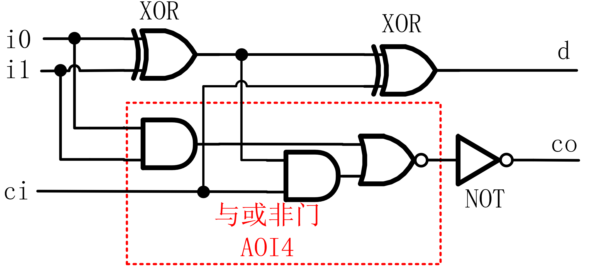
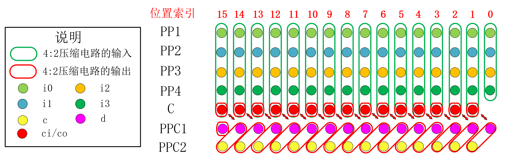
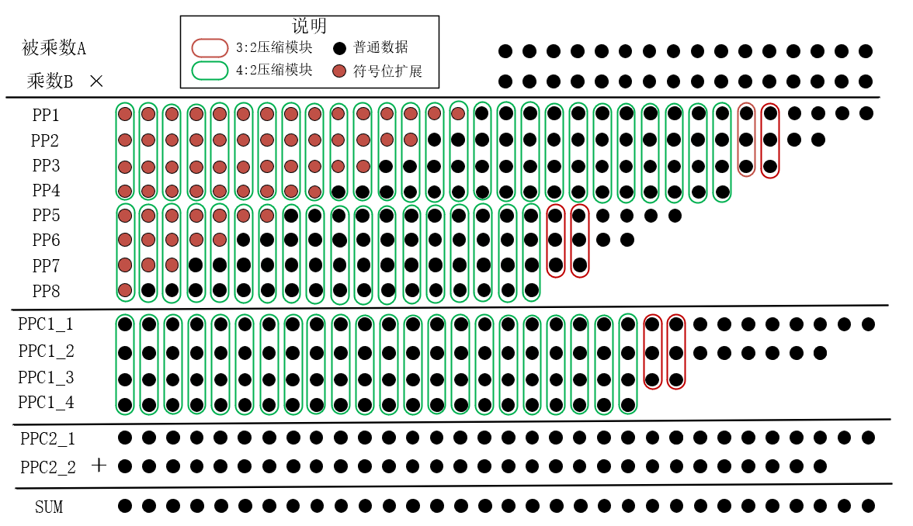
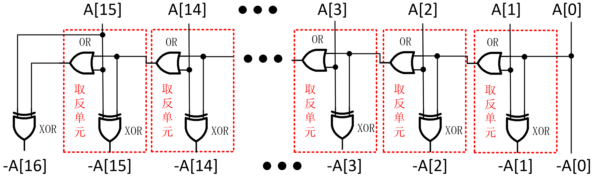
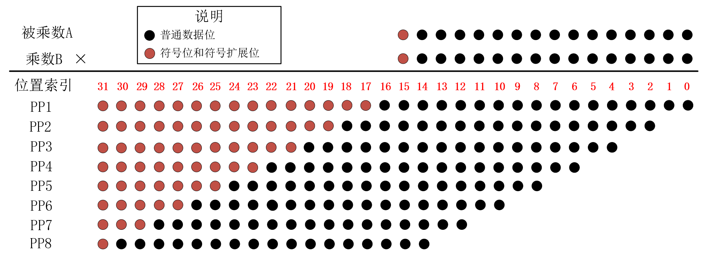
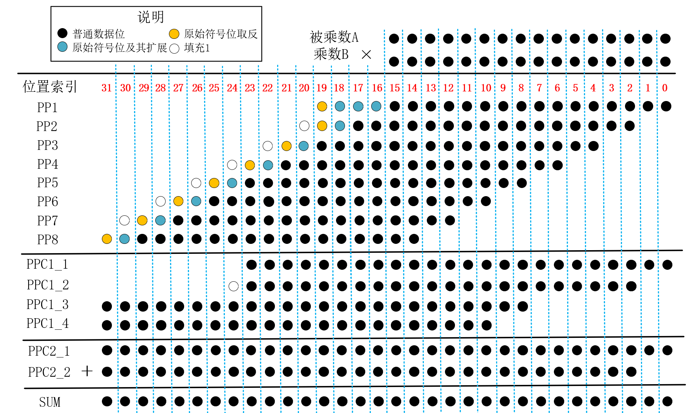
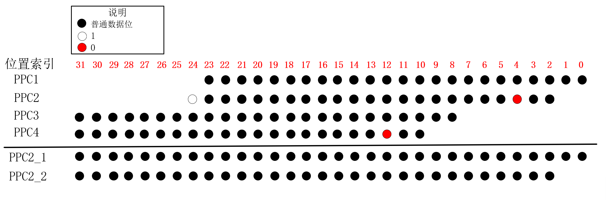

### 摘要

乘法运算是数字信号处理和机器学习等应用的核心运算，乘法器的性能对于这些应用的表现起着至关重要的作用。本设计通过Verilog硬件描述语言构建了一个16位*16位的高效定点有符号数乘法器，在保证乘法器性能满足特定要求的前提下，通过优化乘法器的内部结构，并提出多个特殊的电路结构来减少电路逻辑资源使用量。

功能验证方面，在Modelsim仿真软件上进行了随机数验证和输入数据遍历测试，仿真结果表明，乘法器对于所有可能的输入数据，计算结果均正确。

模块资源统计方面，使用yosys综合工具对本设计进行综合，统计了本设计所用到的所有子模块数量，结合各个子模块的电路资源，统计了每个模块的所用的具体门电路的数量和资源代价。统计结果表明，本设计的资源代价分为6538。

性能统计方面，通过统计所用的所有模块电路端到端之间的性能代价，并结合到本文所设计的全局电路中，计算了电路中每一个连线相对于乘法器电路输入的最大性能代价。统计结果表明，本设计关键路径的性能代价分为478。

### 基本原理

通常乘法运算包括三个主要的运算过程，分别是(1)部分积的产生：将“被乘数”乘以“乘数”，得到称为”部分积“的中间数据。（2）部分积压缩：使用特定的乘法器结构，将产生的多个部分积最终压缩到两行。（3）求和：使用加法器将压缩后的两个部分积求和，得到最终的乘积结果。本设计的部分积生成采用Radix-4 Booth乘数编码算法，而部分积压缩采用Wallace树型乘法器结构，部分积求和采用了混合半加器和全加器结构的经过优化的32位加法器，本章将简单介绍Radix-4 Booth算法和Wallace压缩方案的原理。

#### Radix-4 Booth算法原理

Radix-4 Booth乘数编码算法是一种用来减少部分积项数的算法方案，对于一个以 $n$位二进制补码形式表示的乘数`B`，其值为：

$$B=B[n-1] \times (-2^{n-1})+\sum_{i=0}^{n-2}B[i] \times 2^i \tag{1}$$

式(1)中， $B[i]$ 代表数据`B`的第i位的值。

本设计中乘法器输入的乘数 `B`是16位的,代入式(1)，则可以表示为：

$$\begin{align}
B&= -B[15]2^{15}+B[14]2^{14}+ \cdots +B[0]2^{0} \\
&= (-2B[15]+B[14]+B[13])2^{14} + (-2B[13]+B[12]+B[11])2^{12}+ \cdots + (-2B[1]+B[0]+B[-1])2^{0}\tag{2}
\end{align}$$
$$
\begin{align}
B_{D} &= -B[15]2^{15}+B[14]2^{14}+ \cdots +B[0]2^{0} \\
&= (-2B[15]+B[14]+B[13])2^{14} + (-2B[13]+B[12]+B[11])2^{12}+ \cdots + (-2B[1]+B[0]+B[-1])2^{0}\tag{2}
\end{align}
$$

其中B[-1]代表额外补充的乘数`B`的第"-1"位，这一位规定为0。将被乘数数据的相邻的三位 $\left\{B[i+1],B[i],B[i-1] \right\}$视为一个整体，则(2)式与(1)式相比，2的幂次项从16个减少到8个，从而`A`与`B`相乘后的部分积项数也从16个减少到8个，减少了后续为处理部分积的电路资源开销。

Radix-4 Booth编码与所对应的部分积操作之间的对应关系如表1所示，从表中可知，Radix-4 Booth编码方案中部分积操作数一共有五类，即`0`、`+A`、`+2A`、`-A`、`-2A`。其中，`0`是确定数 ，`+A`就是乘法器的输入，`+2A`直接由输入的`+A`数据左移一位得到，这些数据都是现有的。而对于`-A`、`-2A`的生成，将`-A`左移一位即可得到`-2A`，只需要通过电路资源额外生成一个`-A`操作数，逻辑资源开销较小，适合于硬件电路实现。

表1. Radix-4 Booth乘数编码与部分积操作对照表

$$
\begin{array}{|c|c|c|}
\hline
{\{B_{i+1},B_{i},B_{i-1}\}}&{-2B_{i+1}+B_{i}+B_{i-1}}&{部分积操作}\\
\hline
{000}&{0}&{0}\\
\hline
{001}&{+1}&{A}\\
\hline
{010}&{+1}&{A}\\
\hline
{011}&{+2}&{2A}\\
\hline
{100}&{-2}&{-2A}\\
\hline
{101}&{-1}&{-A}\\
\hline
{110}&{-1}&{-A}\\
\hline
{111}&{0}&{0}\\
\hline
\end{array}
$$

举例来说，对于一个16bit*16bit有符号数的计算，假设乘数`B`为16'b1000_1000_1100_1110，被乘数`A`为16'b1000_1000_1100_1111，首先对乘数`B`进行分段booth解码，分段解码的过程如图1所示。

图1. Radix-4 Booth算法分段解码过程示例

完成booth分段解码后，依据解码值得到相应的booth部分积操作数，然后将这些部分积操作数按照进行排列，将权值相同的数据位放在同一列，排列后的数据示意图如图2所示，接着再进行后续的部分积压缩、求和操作。图2中PP代表部分积(partial product),图中黑色数字代表部分积操作数，红色数字代表符号位扩展的位置。

从图2中可以看出，Radix-4 Booth乘法排列中，相邻的部分积操作数错开2位，而不是传统竖式乘法运算中的1位，这是由于(2)式中，相邻的2的幂次项的指数部分相差2，而在(1)式中相邻的2的幂次项的指数部分只相差1。

每个部分积操作数位宽都是18bit，因为一个 $n$位二进制补码的数据表示范围为 $[-2^{n-1},2^{n-1}-1]$, 对于16位的补码来说，这一值就是 $[-32768,32767]$, 对于被乘数 $A=-32768$的情况，其相反数 $-A=-32768$，这一值已经超出16位补码的表示范围，至少需要17位补码来正确表示，由此`-2A`则至少需要18位补码来正确表示，所以即使不考虑符号扩展位，部分积操作数的位宽至少需要18位位宽来表示。

图2. Radix-4 Booth竖式乘法运算过程示例

#### wallace乘法器基本原理

wallce乘法器是一种使用全加器、半加器等模块，将原来多个部分积进行压缩，最终输出两个部分积的一种乘法器结构。常见的部分积压缩有3：2压缩和4：2压缩，3：2压缩将输入的3个部分积压缩成2个部分积，4：2压缩将输入的4个部分积压缩成2个部分积。

一种常用的3：2压缩电路如图3所示，这一电路结构实际上是全加器，电路输入3个来自不同部分积的比特位`i0`、`i1`、`ci`，最终输出压缩后的两个部分积的比特位`d`、`co`。

图3. 一种3:2压缩模块门级电路结构

一种常用的4：2压缩电路如图4所示，这一结构使用两个3:2压缩器级联得到。该电路结构输入4个部分积比特位`i0`-`i3`以及来自上一级压缩器的进位信号`ci`，最终生成2个压缩后的部分积比特位`d`和`c`，电路的进位输出`co`与进位输入`ci`无关，只要当`i0`、`i1`、`i2`确定，`co`输出就确定，不会造成进位链的传播。

图4. 一种4:2压缩模块的门级电路结构

使用4：2压缩模块将4个部分积压缩为2个的示例如图5所示，图中`PP1`-`PP4`为待压缩的4个部分积，`PPC1`、`PPC2`为压缩后的2个部分积，C为进位连线，连接低位压缩电路的进位输出`co`和更高1位的进位输入`ci`。从图5中可见，对于某一特定权位进行4：2压缩时，压缩电路的三个输出只有`d`保留在原来的权值位置上，另外两个输出`co`和`c`要移动到更高1位的位置上。`co`和`c`是同权值的，理论上两者都可以输入到高1位的进位输入`ci`，但结合前文对4:2压缩器的路径分析，进位输出`co`与进位输入`ci`无关，应该将低位的4:2压缩器的进位输出`co`连接到高1位的进位输入`ci`上，这样才不会造成进位链传播的问题。

图5. 4:2压缩模块的使用示例

使用3：2压缩模块将3个部分积压缩为2个的示例如图6所示，与4：2压缩模块的使用示例相似，但3：2压缩模块使用时，相邻模块之间并没有进位连线，因为3：2压缩电路的进位输出`co`直接保留为压缩后的部分积，并不在相邻模块间传播。

图6. 3:2压缩模块的使用示例

### 本设计创新点

本设计在保证电路的关键路径长度满足一定限制的前提下，通过各种手段优化电路的逻辑资源用量，这些手段主要有：

1. 在部分积的生成阶段，设计了一个特殊的低资源开销的"取反电路"，可以直接在进行部分积压缩之前生成`-A`、`-2A`这两个部分积操作数。

   在传统的booth加法器中，在进行部分积压缩前，首先生成被乘数的非( $\overline{A}$)，而 $\overline{A}+1$才是原本需要用到的相反数`-A`，传统方法使用“加一补偿位”来处理部分积操作数为`-A`、`-2A`的情况，即将求相反数的“取反加一”操作的”加一“操作转移到部分积压缩过程中。

   带有补偿位的16bit*16bit乘法矩阵如图7所示，这一乘法器矩阵的排列方式使得每个部分积的低位的下方都增加了1位补偿位，需要对低位使用部分积压缩电路，同时由于补偿位的存在，部分积个数变成了9个，需要额外的电路处理这一个多出来的部分积，而在本设计中没有这些补偿位，低位数据可以不经过运算直接保留，也没有多出来的一个部分积，不仅节约了电路资源，也缩短了潜在的关键路径。

   

   
图7. 传统booth乘法器的乘法矩阵

2. 在部分积压缩过程中，依据不同权值位置上的数据特点，依据不同的数据输入情况，设计了特殊的压缩模块，减少了逻辑资源的开销和模块关键路径的长度。

3. 使用门电路结构来重新搭建”异或门“、”同或门“等效结构，使得”与非门“、”或非门“的内部信号可以复用，减少了电路逻辑资源开销。

4. 使用符号位编码方案，减少了每一个部分积的符号扩展位数，从而减少了压缩模块的使用量。

有关设计细节和优化方案将在下一章进行详细描述。

Radix-4 Booth算法得到的部分积矩阵如图6所示，图6中黑点代表部分积原始操作数(Radix-4 Booth编码方案得到的`0`、`A`、`-A`、`2A`及`-2A`)，红点代表有符号数的符号扩展位，`PP1`-`PP8`依此代表由Radix-4 Booth算法得到的部分积1到部分积8，`PPC1_1`-`PPC1_4`代表wallace压缩时第一级压缩后产生的4个部分积，`PPC2_1`、`PPC2_2`代表wallace压缩后最终得到的两个部分积。

在本设计中，对不同权值位的压缩过程，使用了不同的模块来进行"4:2压缩"，图6中绿色框框住的位置使用标准的4:2压缩模块，红色线框框住的几个部分积的比特位使用3:2压缩模块，因为这些位置上的有效数据只有三个，使用3:2压缩器即可将部分积压缩到两个，相比于使用4:2压缩，这一设计减少了电路逻辑资源开销。

图6. Radix-4 Booth算法得到的部分积压缩过程示意图

### 设计详解

本设计整体结构可以分为3大部分，分别是：

- 部分积操作数生成
- 部分积压缩
- 部分积的求和

本章将对三大部分的设计细节进行解释和说明。

#### 部分积操作数生成

本设计中，部分积生成模块`boot2_pp_gen`输入数据为16bit的被乘数`A_NUM`和乘数`B_NUM`，输出8个Radix-4 Booth乘数编码算法产生的18bit部分积操作数`PP1`-`PP8`。

分析部分积生成过程，发现其中存在着如下的规律：

1. 在16bit*16bit有符号数乘法中，Radix-4 Booth编码方案需要得到`0`、`A`、`-A`、`2A`及`-2A`一共五种18bit部分积操作数，通过观察这五种数据的规律，可以发现：

   1. `A`、`-A`使用17bit表示就已足够，这两个操作数的18bit表示中，最高位与次高位相同，运算得到`A`、`-A`时，只需要处理低17位数据。`2A`、`-2A`的最低位一定是0，运算得到`2A`、`-2A`时，无需考虑最低位的生成，所以部分积操作数`ppx`的最高位和最低位，相比于其他位置上的数据，可以使用更为简单的电路产生。
   2. `2A`可以由`A`左移一位得到，`-2A`可以由`-A`左移一位得到，而`A`直接由输入得到，因此，对于5类部分积操作数，只需要通过额外的电路计算`-A`，就能得到全部的5类部分积操作数。由于8个部分积操作数的生成过程都有可能用到`-A`信号，因此，可以设计一个专用的计算`-A`的电路模块`inv_converter_16`，其计算的结果作为中间数据，分为8路输入到多个部分积操作数解码模块`pp_decoder`，实现`-A`数据的复用。
2. Radix-4 Booth编码方案中，对于第一个部分积操作数的生成，乘数编码的最低位(`B[-1]`)一定是0，相比其他位置的乘数编码，可以使用专用的解码电路实现Booth译码，减少了电路逻辑资源开销。

##### 取反加一模块设计与优化

由上述规律1.2，需要设计一个电路来得到17bit数据源`-A`，从`A`到`-A`，在补码操作上就是“按位取反，末位加1”的过程。传统的17bit”取反加一“电路如图7所示，该结构使用了多个半加器模块，通过逻辑化简，消去输入端的非门，得到新的”取反加一“电路结构如图8所示。

图7. 传统取反加一模块结构示意图

图7. 逻辑化简后的取反加一模块结构示意图

##### 操作数生成模块设计

综合规律1.1及1.2，对于一个部分积操作数`ppx`，其数据来源有三种，即`A`、`-A`、`0`，另外两个部分积操作数`2A`、`-2A`都是这些数据源的变体。本设计使用两个标志信号`flag_s1`、`flag_s2`的组合来选择数据来源`pp_source`，接着通过`flag_2x`标志信号确定数据源是否需要左移操作，以生成最终的17bit部分积操作数`ppx`。

三个标志信号与相应的部分积操作的对应关系如表2所示。

表2. 标志信号与部分积操作数对应表

$$
\begin{array}{|c|c|c|c|}
\hline
{部分积操作数}&{flag\_2x}&{flag\_s1}&{flag\_s2}\\
\hline
{A}&{0}&{0}&{1}\\
\hline
{-A}&{0}&{1}&{0}\\
\hline
{2A}&{1}&{0}&{1}\\
\hline
{-2A}&{1}&{1}&{0}\\
\hline
{0}&{X}&{1}&{0}\\
\hline
\end{array}
$$

本设计中,选择数据源`A`、`-A`、`0`的电路结构如图8所示，该电路实际上是一个”与或非门”，其输入的标志信号`flag_s1`、`flag_s2`与输出的部分积操作数数据源`pp_source`的对应关系如表3所示。

图8. 部分积操作数数据源生成电路

注意：这一数据源选择电路输出的数据源`pp_source`实际上不是`A`、`-A`、`0`的原始数据，而是这些数据按位取反后的数据。后续电路将直接利用这个取反后的数据，以达到节省电路资源的目的，这一内容将在下文讲解。

表3. 标志信号与部分积数据源对应表

$$
\begin{array}{|c|c|c|}
\hline
{部分积操作数数据源}&{flag\_s1}&{flag\_s2}\\
\hline
{A}&{0}&{1}\\
\hline
{-A}&{1}&{0}\\
\hline
{0}&{0}&{0}\\
\hline
\end{array}
$$

 当部分积操作数数据源确定后，对于有特定数据的数据源（`A`、`-A`），下一步需要确定数据源`pp_source`是否需要左移操作，对于输出部分积操作数`ppx`的第`i`位，有两种可能结果：

 - 需要移位的数据，即`pp_source`的第`i-1`位取反后的数据
 - 不需要移位的数据，即`pp_source`的第`i`位取反后的数据

通过`flag_2x`信号来确定输出部分积操作数`ppx`的第`i`位，`ppx[i]`的逻辑表达式如式子(3)所示。

$$ppx[i] = \overline{flag\\_2x \cdot pp\\_source[i-1] +  \overline{flag\\_2x} \cdot pp\\_source[i]} \tag{3}$$
$$
ppx[i] = \overline{flag\_2x \cdot pp\_source[i-1] +  \overline{flag\_2x} \cdot pp\_source[i]} \tag{3}
$$

由表达式可知，这一逻辑表达式在`flag_2x`和`！flag_2x`已经得到的情况下，使用”与或非门”即可实现，其电路结构如图9所示。

图9. 部分积操作数单bit数据数据源选择电路

综上，部分积操作数单bit信号生成模块的门电路结构如图10所示。

图10. 部分积操作数单bit生成模块电路结构示意图

特别地，对于`ppx[0]`，(3)式可以改写为(4)式，使用一个或非门即可实现该数据的计算。

$$\begin{align}
ppx[0] &= \overline{\overline{flag\\_2x} \cdot pp\\_source[0]}\\
&= \overline{flag\\_2x + pp\\_source[0]} \tag{4}
\end{align}$$
$$
\begin{align}
ppx[0] &= \overline{\overline{flag\_2x} \cdot pp\_source[0]}\\
&= \overline{flag\_2x + pp\_source[0]} \tag{4}
\end{align}
$$

而对于`ppx[16]`，由于生成的部分积数据源`pp_source`实际上是16bit的，其17bit数据位是16bit数据位的符号扩展，故而`pp_source[15]`和`pp_source[16]`是一样的数据，因此(3)式可以改写为(5)式，直接使用一个非门即可实现数据输出。

$$\begin{align}
ppx[16] &= \overline{flag\\_2x \cdot pp\\_source[15] +  \overline{flag\\_2x} \cdot pp\\_source[16]}\\
&= \overline{flag\\_2x \cdot pp\\_source[15] +  \overline{flag\\_2x} \cdot pp\\_source[15]} \\
&=\overline{pp\\_source[15]}\tag{5}
\end{align}$$
$$
\begin{align}
ppx[16] &= \overline{flag\_2x \cdot pp\_source[15] +  \overline{flag\_2x} \cdot pp\_source[16]}\\
&= \overline{flag\_2x \cdot pp\_source[15] +  \overline{flag\_2x} \cdot pp\_source[15]} \\
&=\overline{pp\_source[15]}\tag{5}
\end{align}
$$

通过以上分析，一个完整的部分积`ppx`的生成，所用的电路模块如图11所示，将这一模块重复叠加8个，即可得到完整的8个部分积操作数。

图11. 部分积操作数生成模块全局电路示意图

##### booth译码电路

综合表1和表2，可以得到Booth乘数编码与标志信号对照表如表4所示，这也是本设计的booth译码电路的真值表。

表4. Radix-4 Booth乘数编码与标志信号对照表

$$
\begin{array}{|c|c|c|c|}
\hline
{\{B_{i+1},B_{i},B_{i-1}\}}&{flag\_2x}&{flag\_s1}&{flag\_s2}\\
\hline
{000}&{x}&{0}&{0}\\
\hline
{001}&{0}&{0}&{1}\\
\hline
{010}&{0}&{0}&{1}\\
\hline 
{011}&{1}&{0}&{1}\\
\hline
{100}&{1}&{1}&{0}\\
\hline
{101}&{0}&{1}&{0}\\
\hline
{110}&{0}&{1}&{0}\\
\hline
{111}&{x}&{0}&{0}\\
\hline
\end{array}
$$

由表4，可以得到三个标志信号的逻辑表达式分别如(6)-(8)式：

$$flag\\_2x=B_{i+1} \odot B_{i} \tag{6}$$ 
$$
flag\_2x=B_{i+1} \odot B_{i} \tag{6}
$$
$$flag\\_s1=\overline{\overline{B_{i+1}}+B_{i} \cdot B_{i-1}}\tag{7}$$
$$
flag\_s1=\overline{\overline{B_{i+1}}+B_{i} \cdot B_{i-1}}\tag{7}
$$
$$flag\\_s2=\overline{B_{i+1}+\overline {B_{i} + B_{i-1}}}\tag{8}$$
$$
flag\_s2=\overline{B_{i+1}+\overline {B_{i} + B_{i-1}}}\tag{8}
$$
由三个标志信号的逻辑表达式可知，(6)式使用一个同或门产生，(7)式使用一个非门结合一个与或非门产生，(8)式使用两个级联的或非门产生，译码电路的门级结构如图12所示，生成的三类标志信号输入到图9中的部分积操作数生成模块，即可实现Booth乘数编码的译码以及部分积操作数的生成。

图12. 标志信号生成电路

#### 部分积压缩

部分积压缩模块`booth2_pp_compressor`输入8个部分积操作数`pp1`-`pp8`，最终得到两个压缩后的部分积输出`PPout1`和`PPout2`。本设计每一次部分积的压缩均采用"4:2压缩"方案，4：2压缩器的输入4个部分积，得到压缩后的两个部分积。

##### 4:2压缩器整体结构

假设现有4个由booth编码算法生成的4个部分积`pp1`-`pp4`，欲将其输入到“4:2压缩器”得到两个压缩后的部分积`ppc1`、`ppc2`，部分积乘法矩阵图如图13所示，从图中可以观察到如下规律：

图13. Radix-4 Booth算法得到的部分积矩阵图

1. 位置索引为3:0的权位有效的数据输入不到两行，矩阵图空白的地方都是0，在这些权位上，天然就是两个部分积，故而无需额外处理即可作为压缩后部分积的输出。
2. 位置索引为5:4的索引，有效的部分积输入是3个，使用3:2压缩模块即可生成两个压缩后的部分积，这在前文已经提到过。
一次部分积的压缩过程如图14所示，图13中黑色虚线框代表“天然”的两个部分积，无需压缩，直接保留。红色线框圈住的部分代表使用3:2压缩器的位置，绿色线框圈住的部分代表使用4:2压缩器的位置。
对于压缩器模块的输出数据，绿色圆点代表压缩器输出结果保留到本级权重的数据，即图4中和图5中压缩模块的输出数据`d`，蓝色圆点代表压缩器输出结果输出到更高一级权重的数据，即图4中3：2压缩模块的输出数据`co`或者图5中4：2压缩模块的输出数据`c`。

 
图14. 部分积压缩过程示意图

##### 部分积符号位处理

传统的Radix-4 Booth算法得到的部分积矩阵图如图15所示，图中红色圆点代表部分积的符号位扩展，对于某一个特定的部分积`ppx`来说，其红色圆点上的数据都是一样的，即图中同一行的圆点代表的值是一样的，这些扩展位的存在消耗了大量的4:2压缩器资源。

 
图15. 传统Radix-4 Booth乘数编码方案的部分积矩阵

鉴于符号位直接扩展带来的较大的电路资源开销，本设计并未直接采用符号位扩展，而是采用了一种符号位编码方案，现就其原理进行介绍。

假设`pp1`-`pp8`的符号位为 $S_i$ ，其中 $i$ 为1-8，对于图14中的符号位，其值可以表达为(9)式：
$$
\begin{align}
sign &= \sum _{i=1}^{8} S_{i}\sum_{j=2i+15}^{31}2^j \\
&= \sum _{i=1}^{8}[(1-\overline{S_i})(2^{32}-2^{2i+15})] \\
&= \sum _{i=1}^{8}(\overline{S_i} \cdot2^{2i+15}) +10923 \times2^{17} \tag{9}
\end{align}
$$
(9)式中，`10923`为二进制`10101010101011`，相当于在原先产生的部分积的第17、18、20、22、24、26、28、30位补充1，再加上求和符号对应权位的值，可以得到经过符号位编码后的部分积乘法矩阵如图16所示。浅蓝色圆点代表原始数据的符号位及其扩展位，黄色圆点代表符号位经过非门取反后得到的数据，白色圆点代表1bit信号`1`, 在同一行部分积中，蓝色点的值都相同，黄色点数据一定是蓝色点数据经过取反后的数据，注意：不同行的蓝色点、黄色点数据没有关联。

图16. 经过符号位编码后的部分积矩阵

##### 部分积压缩过程

观察图15中编码后的数据，可以发现对于前四个部分积`pp1`-`pp4`，其部分积数据存在以下规律：

- 位置索引6上使用的“4:2压缩模块”可以不考虑进位输入`cin`，因为低一位权位上使用的3:2压缩模块的进位输出`co`不会传播到位置索引6上使用的“4:2压缩模块”，可以设计一个不考虑进位输入的4:2压缩模块`non_cin_4_2_compressor`，其电路结构如图17所示，相比于标准的4:2压缩模块，其电路资源开销变小。

- 位置索引20位置上的“4:2压缩模块”有2个确定的输入，即来自`PP1`的0和来自`PP2`的`1`，为这个确定的输入设计专用的“4:2”压缩模块“，其电路结构如图18所示，相比于标准的4:2压缩模块，其电路资源开销变小。
- 位置索引21上的“4:2压缩模块”实际上只有三个有效输入信号，即来自上级压缩器的进位输入`cin`、来自`pp3`、`pp4`的数据，因此，使用3:2压缩器即可实现原来4:2压缩器的功能，且3:2进位输出信号`co`直接保留到`PPC1_2`,不会造成进位链延长的问题。
- 位置索引22上的“4:2压缩模块”只有2个有效输入，即来自`pp4`的数据和`pp3`上的`1`,实际上就是将`pp4`的数据加1保留到`PPC1_1`，并产生进位信号到`PPC1_2`的过程。 
- 位置索引23、24位置上的有效部分积项数不超过2个，可以直接保留。

图17. 不考虑进位输入的4:2压缩模块门级电路结构

图18. 有2个确定输入分别为0、1的4:2压缩模块

结合以上规律，本设计第一级压缩处理`pp1`-`pp4`的过程如图19所示，有关说明可以参见图例。

图19. PP1-PP4的压缩过程示意图

观察图16中编码后的数据，可以发现对于后四个部分积`pp5`-`pp8`，其数据分布还存在以下规律：
- 位置索引26上的“4:2压缩模块”有一个确定的输入，即来自`PP5`的1，为这个确定的输入设计专用的“4:2”压缩模块“，其电路结构如图20所示，相比于标准的4:2压缩模块，其电路资源开销变小。
- 位置索引27上的“4:2压缩模块”有一个确定的输入，即来自`PP5`的0，为这个确定的输入设计专用的“4:2”压缩模块“，其电路结构如图21所示，同样减小了电路资源开销。
- 位置索引28上的“4:2压缩模块”有确定的两个输入0和1，使用上文提到的有确定输入为0、1的结构，参见图18。
- 位置索引29上直接使用“3:2压缩模块”。
- 位置索引30上的“4:2压缩模块”只有两个有效输入，即来自`pp8`的数据和`pp7`上的`1`,实际上就是将`pp8`的数据加1保留到`PPC1_3`，并产生进位信号到`PPC1_4`即可。 
- 位置索引31位置上的有效部分积项数不超过两个，可以直接保留。

图20. 有一个确定输入为1的4:2压缩模块

图21. 有一个确定输入为0的4:2压缩模块

结合以上规律，本设计第一级压缩处理`pp5`-`pp8`的过程如图22所示，有关说明可以参见图例。

图22. PP5-PP8的压缩过程示意图

经过第一级压缩后，得到的部分积矩阵图如图23所示。

图23. 第二级压缩部分积矩阵图

观察图中点阵，可以发现如下规律：
- 在位置索引7-0上"天然"就是两个部分积，因此直接保留到`PPC2_1`、`PPC2_2`即可。
- 在位置索引10上，没有来自上一级压缩器的进位信号，有效输入数据只有4个，使用不考虑进位输入的4:2模块，参见图17。
- 在位置索引12上，`PPC1_4`为0，因此也可以使用不考虑进位输入的4:2模块，参见图17。
- 位置索引24上的“4:2压缩模块”有确定的两个输入0和1，使用上文提到的有确定输入为0、1的结构，参见图18。
- 位置索引25上只有三个有效数据，使用3:2压缩模块即可达到压缩成两个部分积的目的。
- 位置索引30：26上只有两个有效数据，使用半加器即可实现"4:2"压缩，这里半加器的进位保留到`PPC2_2`，而不是输出到别的加法模块，因此，不产生进位链延长的问题。
- 位置索引31上的压缩器，进位输出被舍去，这一级只需要产生同权值位的数据即可，使用一个异或门对`PPC1_3`、`PPC1_4`进行异或，即可实现这一功能，节省了电路资源。

综上分析，第二级压缩过程如图24所示。

图24. 第二级压缩部过程示意图

结合本章分析，两级部分积压缩的全体过程如图25所示。

图25. 部分积压缩全流程示意图

#### 部分积求和

通过构建wallace tree进行部分积压缩后，得到两个压缩后的部分积`PPC2_1`和`PPC2_2`，需要将这两个部分积通过加法器进行求和即可得到最终的乘法器的输出`C_NUM`。
常用的加法器结构有行波进位加法器和超前进位加法器，超前进位加法器逻辑资源开销大，但不会造成进位链延长，关键路径较短。行波进位加法器存在进位信号的级联线，因此关键路径较长，但资源开销较小。
考虑到本设计压缩部分低位数据基本都是直接保留，并未经过过多的额外电路，中间位置数据使用4:2压缩器关键路径并没有非常长，因此本设计以尽可能少的资源为首要追求。
两个压缩后的部分积`PPC2_1`和`PPC2_2`，其加法矩阵如图26所示。

图26. 部分积加法矩阵图

图25中红色圆点代表0，由于存在这一个特例，因此在位置索引为4、8的位置，可以使用半加器替代全加器，节省资源开销。在位置索引为1:0的地方只有一个数据`PPC2_1`，因此无需进行加法运算，直接输出即可。本设计使用的加法流程如图27所示。

图27. 加法器结构

### 测试仿真

使用verilog 硬件描述语言搭建了本设计所提出的乘法器，并编写testbench对各个模块进行仿真测试。

对于顶层模块`HIS_MULT`的仿真，在testbench文件中产生了两个随机数`A_NUM`、`B_NUM`，并在testbench中计算`A_NUM`与`B_NUM`的有符号乘积`C_NUM_real`，同时将`A_NUM`与`B_NUM`输入到例化的乘法器顶层模块`HIS_MULT`中，得到输出的模块计算结果`C_NUM`，在testbench中设计一个标志信号`correct`，当`C_NUM`==`C_NUM_real`时输出为1，反之为0。

在Modelsim仿真软件中测试到的部分仿真结果如图28所示，由图可见，本设计所提出的乘法器的计算结果正确，经过较多的随机数仿真后，也有`C_NUM`==`C_NUM_real`(`correct`==1)的现象。

图28. 仿真验证结果

