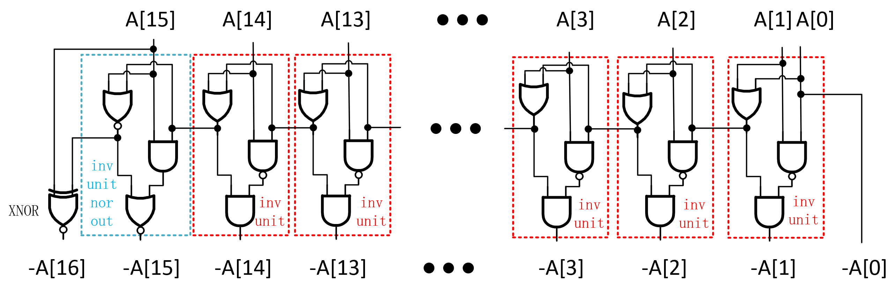
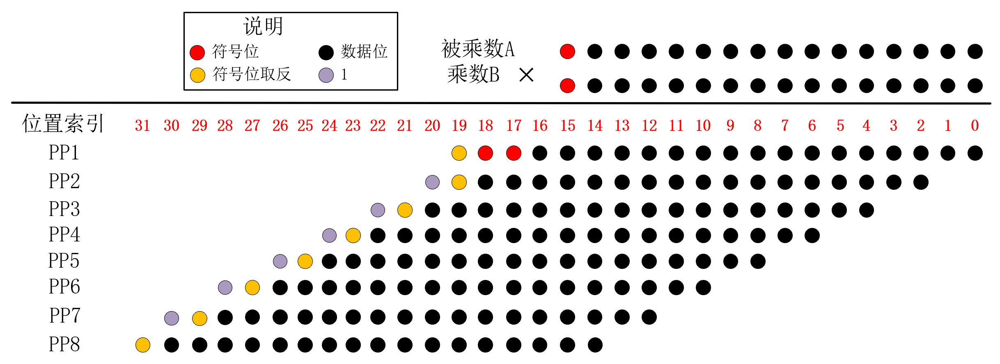
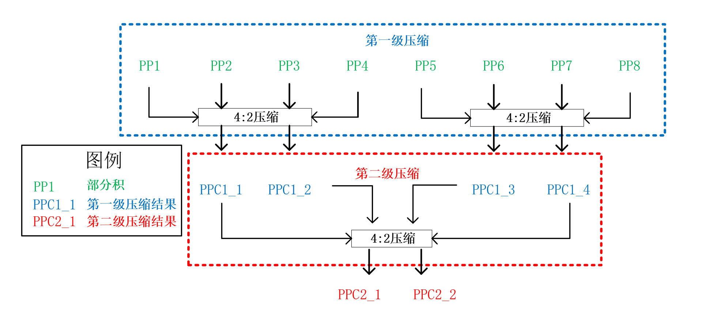
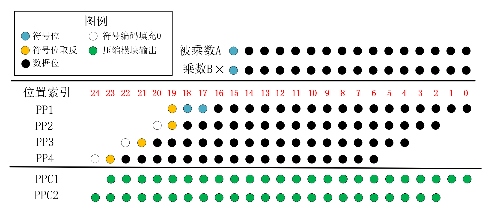
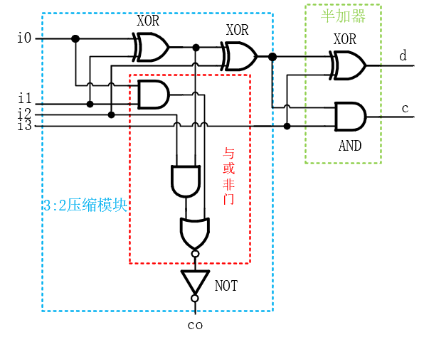
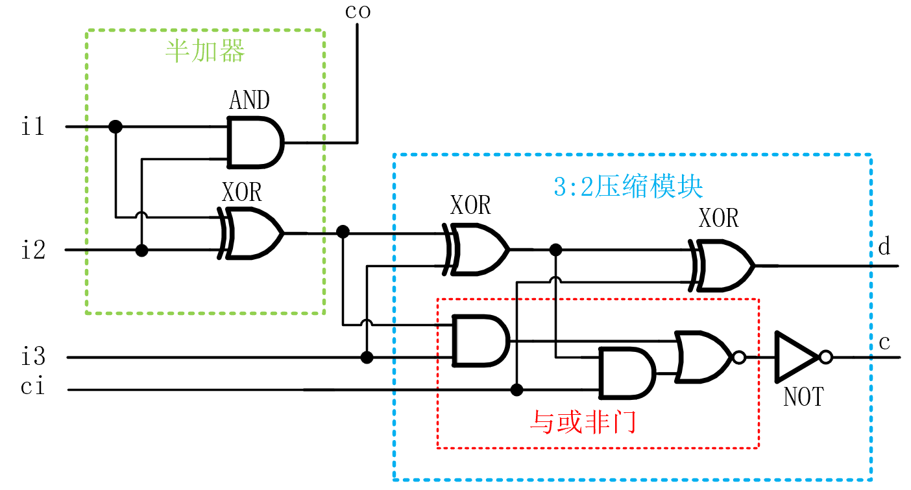

### 摘要

乘法运算是数字信号处理和机器学习等应用的核心运算，乘法器的性能对于这些应用的表现起着至关重要的作用。本设计通过Verilog硬件描述语言构建了一个16位*16位的高效定点有符号数乘法器，在保证乘法器性能满足特定要求的前提下，通过优化乘法器的内部结构，并提出多个特殊的电路结构来减少电路逻辑资源使用量。

功能验证方面，在Modelsim仿真软件上进行了随机数验证和输入数据遍历测试，仿真结果表明，乘法器对于所有可能的输入数据，计算结果均正确。

模块资源统计方面，使用yosys综合工具对本设计进行综合，统计了本设计所用到的所有子模块数量，结合各个子模块的电路资源，统计了每个模块的所用的具体门电路的数量和资源代价。统计结果表明，本设计的资源代价分为6538。

性能统计方面，通过统计所用的所有模块电路端到端之间的性能代价，并结合到本文所设计的全局电路中，计算了电路中每一个连线相对于乘法器电路输入端的最大性能代价。统计结果表明，本设计关键路径的性能代价分为477。

对于资源代价分的统计，赛题给出的每个门级电路模块的“资源代价分”恰好是标准CMOS门结构下的CMOS管数量，下文将以CMOS管数量来指代“资源代价分”。

### 基本原理

通常乘法运算包括三个主要的运算过程，分别是(1)部分积的产生：将“被乘数”乘以“乘数”，得到称为”部分积“的中间数据。（2）部分积压缩：使用特定的乘法器结构，将产生的多个部分积最终压缩到两行。（3）求和：使用加法器将压缩后的两个部分积求和，得到最终的乘积结果。本设计的部分积生成采用Radix-4 Booth乘数编码算法，而部分积压缩采用Wallace树型乘法器结构，部分积求和采用了混合半加器和全加器结构的经过优化的32位加法器，本章将简单介绍Radix-4 Booth算法和Wallace压缩方案的原理。

#### Radix-4 Booth算法原理

Radix-4 Booth乘数编码算法是一种用来减少部分积项数的算法方案，对于一个以 $n$位二进制补码形式表示的乘数`B`，其值为：

$$B=B[n-1] \times (-2^{n-1})+\sum_{i=0}^{n-2}B[i] \times 2^i \tag{1}$$

式(1)中， $B[i]$ 代表数据`B`的第i位的值。

本设计中乘法器输入的乘数 `B`是16位的,代入式(1)，则可以表示为：

$$\begin{align}
B&= -B[15]2^{15}+B[14]2^{14}+ \cdots +B[0]2^{0} \\
&= (-2B[15]+B[14]+B[13])2^{14} + (-2B[13]+B[12]+B[11])2^{12}+ \cdots + (-2B[1]+B[0]+B[-1])2^{0}\tag{2}
\end{align}$$
$$
\begin{align}
B_{D} &= -B[15]2^{15}+B[14]2^{14}+ \cdots +B[0]2^{0} \\
&= (-2B[15]+B[14]+B[13])2^{14} + (-2B[13]+B[12]+B[11])2^{12}+ \cdots + (-2B[1]+B[0]+B[-1])2^{0}\tag{2}
\end{align}
$$

其中B[-1]代表额外补充的乘数`B`的第"-1"位，这一位规定为0。将被乘数数据的相邻的三位 $\left\{B[i+1],B[i],B[i-1] \right\}$视为一个整体，则(2)式与(1)式相比，2的幂次项从16个减少到8个，从而`A`与`B`相乘后的部分积项数也从16个减少到8个，减少了后续为处理部分积的电路资源开销。

Radix-4 Booth编码与所对应的部分积操作之间的对应关系如表1所示，从表中可知，Radix-4 Booth编码方案中部分积操作数一共有五类，即`0`、`+A`、`+2A`、`-A`、`-2A`。其中，`0`是确定数 ，`+A`就是乘法器的输入，`+2A`直接由输入的`+A`数据左移一位得到，这些数据都是现有的。而对于`-A`、`-2A`的生成，将`-A`左移一位即可得到`-2A`，只需要通过电路资源额外生成一个`-A`操作数，逻辑资源开销较小，适合于硬件电路实现。

表1. Radix-4 Booth乘数编码与部分积操作对照表

$$
\begin{array}{|c|c|c|}
\hline
{\{B_{i+1},B_{i},B_{i-1}\}}&{-2B_{i+1}+B_{i}+B_{i-1}}&{部分积操作}\\
\hline
{000}&{0}&{0}\\
\hline
{001}&{+1}&{A}\\
\hline
{010}&{+1}&{A}\\
\hline
{011}&{+2}&{2A}\\
\hline
{100}&{-2}&{-2A}\\
\hline
{101}&{-1}&{-A}\\
\hline
{110}&{-1}&{-A}\\
\hline
{111}&{0}&{0}\\
\hline
\end{array}
$$

举例来说，对于一个16bit*16bit有符号数的计算，假设乘数`B`为16'b1000_1000_1100_1110，被乘数`A`为16'b1000_1000_1100_1111，首先对乘数`B`进行分段booth解码，分段解码的过程如图1所示。

图1. Radix-4 Booth算法分段解码过程示例

完成booth分段解码后，依据解码值得到相应的booth部分积操作数，然后将这些部分积操作数按照进行排列，将权值相同的数据位放在同一列，排列后的数据示意图如图2所示，接着再进行后续的部分积压缩、求和操作。图2中PP代表部分积(partial product),图中黑色数字代表部分积操作数，红色数字代表符号位扩展的位置。

从图2中可以看出，Radix-4 Booth乘法排列中，相邻的部分积操作数错开2位，而不是传统竖式乘法运算中的1位，这是由于(2)式中，相邻的2的幂次项的指数部分相差2，而在(1)式中相邻的2的幂次项的指数部分只相差1。

每个部分积操作数位宽都是18bit，因为一个 $n$位二进制补码的数据表示范围为 $[-2^{n-1},2^{n-1}-1]$, 对于16位的补码来说，这一值就是 $[-32768,32767]$, 对于被乘数 $A=-32768$的情况，其相反数 $-A=-32768$，这一值已经超出16位补码的表示范围，至少需要17位补码来正确表示，由此`-2A`则至少需要18位补码来正确表示，所以即使不考虑符号扩展位，部分积操作数的位宽至少需要18位位宽来表示。

图2. Radix-4 Booth竖式乘法运算过程示例

#### wallace乘法器基本原理

wallce乘法器是一种使用全加器、半加器等模块，将原来多个部分积进行压缩，最终输出两个部分积的一种乘法器结构。常见的部分积压缩有3：2压缩和4：2压缩，3：2压缩将输入的3个部分积压缩成2个部分积，4：2压缩将输入的4个部分积压缩成2个部分积。

一种常用的3：2压缩电路如图3所示，这一电路结构实际上是全加器，电路输入3个来自不同部分积的比特位`i0`、`i1`、`ci`，最终输出压缩后的两个部分积的比特位`d`、`co`。

图3. 一种3:2压缩模块门级电路结构

一种常用的4：2压缩电路如图4所示，这一结构使用两个3:2压缩器级联得到。该电路结构输入4个部分积比特位`i0`-`i3`以及来自上一级压缩器的进位信号`ci`，最终生成2个压缩后的部分积比特位`d`和`c`，电路的进位输出`co`与进位输入`ci`无关，只要当`i0`、`i1`、`i2`确定，`co`输出就确定，不会造成进位链的传播。

图4. 一种4:2压缩模块的门级电路结构

使用4：2压缩模块将4个部分积压缩为2个的示例如图5所示，图中`PP1`-`PP4`为待压缩的4个部分积，`PPC1`、`PPC2`为压缩后的2个部分积，C为进位连线，连接低位压缩电路的进位输出`co`和更高1位的进位输入`ci`。从图5中可见，对于某一特定权位进行4：2压缩时，压缩电路的三个输出只有`d`保留在原来的权值位置上，另外两个输出`co`和`c`要移动到更高1位的位置上。`co`和`c`是同权值的，理论上两者都可以输入到高1位的进位输入`ci`，但结合前文对4:2压缩器的路径分析，进位输出`co`与进位输入`ci`无关，应该将低位的4:2压缩器的进位输出`co`连接到高1位的进位输入`ci`上，这样才不会造成进位链传播的问题。

图5. 4:2压缩模块的使用示例

使用3：2压缩模块将3个部分积压缩为2个的示例如图6所示，与4：2压缩模块的使用示例相似，但3：2压缩模块使用时，相邻模块之间并没有进位连线，因为3：2压缩电路的进位输出`co`直接保留为压缩后的部分积，并不在相邻模块间传播。

图6. 3:2压缩模块的使用示例

### 本设计创新点

本设计在保证电路的关键路径长度满足一定限制的前提下，通过各种手段优化电路的逻辑资源用量，这些手段主要有：

1. 在部分积的生成阶段，设计了一个特殊的低资源开销的"取反电路"，可以直接在进行部分积压缩之前生成`-A`、`-2A`这两个部分积操作数。

   在传统的booth加法器中，在进行部分积压缩前，首先生成被乘数的非( $\overline{A}$)，而 $\overline{A}+1$才是原本需要用到的相反数`-A`，传统方法使用“加一补偿位”来处理部分积操作数为`-A`、`-2A`的情况，即将求相反数的“取反加一”操作的”加一“操作转移到部分积压缩过程中。

   带有补偿位的16bit*16bit乘法矩阵如图7所示，这一乘法器矩阵的排列方式使得每个部分积的低位的下方都增加了1位补偿位，需要对低位使用部分积压缩电路，同时由于补偿位的存在，部分积个数变成了9个，需要额外的电路处理这一个多出来的部分积，而在本设计中没有这些补偿位，低位数据可以不经过运算直接保留，也没有多出来的一个部分积，不仅节约了电路资源，也缩短了潜在的关键路径。

   当然，为了在部分积操作数产生过程中直接得到`A`的相反数`-A`，也需要额外的“求相反数”单元，有额外的资源开销，本设计对这一单元进行了优化，使用尽可能少的逻辑资源来实现求相反数的功能。经过测试，本设计先求相反数的方法比“加一补偿位”方法使用的资源量更少。

   

   
图7. 传统booth乘法器的乘法矩阵

2. 在部分积压缩过程中，通过探究不同权值位置上的数据规律，设计了特殊的压缩模块，减少了逻辑资源的开销和模块关键路径的长度。

3. 使用门电路结构来重新搭建”异或门“、”同或门“等效结构，使得”与非门“、”或非门“的内部信号可以复用，减少了电路逻辑资源开销。

4. 使用符号位编码方案，减少了每一个部分积的符号扩展位数，从而减少了压缩模块的使用量。此外，依据所采用的符号位编码的特点，将部分积生成模块和部分积压缩模块进行联合优化，更进一步减少了逻辑资源使用量。

有关设计细节和优化方案将在下一章进行详细描述。

### 设计详解

本设计整体结构可以分为3大部分，分别是：

- 部分积操作数生成
- 部分积压缩
- 部分积的求和

本章将对三大部分的设计细节进行解释和说明。

#### 部分积操作数生成

本设计中，部分积生成模块`boot2_pp_gen`输入数据为16bit的被乘数`A_NUM`和乘数`B_NUM`，输出8个Radix-4 Booth乘数编码算法产生的18bit部分积操作数`PP1`-`PP8`。

分析部分积生成过程，发现其中存在着如下的规律：

1. 在16bit*16bit有符号数乘法中，Radix-4 Booth编码方案需要得到`0`、`A`、`-A`、`2A`及`-2A`一共五种18bit部分积操作数，通过观察这五种数据的规律，可以发现：

   1. `A`、`-A`使用17bit表示就已足够，这两个操作数的18bit表示中，最高位与次高位相同，运算得到`A`、`-A`时，只需要处理低17位数据。`2A`、`-2A`的最低位一定是0，运算得到`2A`、`-2A`时，无需考虑最低位的生成，所以部分积操作数`ppx`的最高位和最低位，相比于其他位置上的数据，可以使用更为简单的电路产生。
   2. `2A`可以由`A`左移一位得到，`-2A`可以由`-A`左移一位得到，而`A`直接由输入得到，因此，对于5类部分积操作数，只需要通过额外的电路计算`-A`，就能得到全部的5类部分积操作数。由于8个部分积操作数的生成过程都有可能用到`-A`信号，因此，可以设计一个专用的计算`-A`的电路模块`inv_converter_16`，其计算的结果作为中间数据，分为8路输入到多个部分积操作数解码模块`pp_decoder`，实现`-A`数据的复用。
2. Radix-4 Booth编码方案中，对于第一个部分积操作数的生成，乘数编码的最低位(`B[-1]`)一定是0，相比其他位置，可以使用更为简单的编码电路实现Booth编码，减少了电路逻辑资源开销。

##### 取反加一模块设计与优化

由上述规律1.2，需要设计一个电路来得到17bit数据源`-A`，从`A`到`-A`，在补码操作上就是“按位取反，末位加1”的过程。传统的17bit”取反加一“电路如图8所示，该结构与“先取反，再加一”的过程对应，其中使用了15个半加器模块。

图8. 传统取反加一模块结构示意图

通过逻辑化简，消去图8中输入端的非门，得到新的”取反加一“电路结构如图9所示，该结构的基本组成单元为"取反单元"，"取反单元"的CMOS管数量与传统取反加一模块内的“半加器”一样，故逻辑化简后电路结构相比优化前的电路，减少了16个非门所用的CMOS管数量。

图9. 逻辑化简后的取反加一模块结构示意图

从逻辑化简后的结构出发，该结构还可以更进一步进行化简，图9中每个“取反单元”都由一个异或门(XOR)和一个或门(OR)组成，对于一个`A`与`B`的异或运算，有(3)式运算：

$$A \oplus B=\overline{A}B+A\overline{B}=(A+B) \cdot \overline{AB} \tag{3}$$
$$
A \oplus B=\overline{A}B+A\overline{B}=(A+B) \cdot \overline{AB} \tag{3}
$$
在(3)式最右侧，出现了 $A + B$，即`A`与`B`的或运算，这一结果可以用作或门(OR)的运算结果，实现数据复用，进行优化后的“取反单元”的电路如图10所示，该结构相比图9中的取反单元减少了2个CMOS管，也就是2分资源代价。

图9. 优化后的取反单元

使用经过优化后的取反单元，并将其称为`inv_unit`，得到优化后的求相反数电路如图10所示。

图9. 使用优化后的取反单元搭建的求相反数电路

可以对图9中的结构进行进一步优化，与(3)式类似，两个数`A`和`B`的异或运算还可以表达为(4)式：

$$A \oplus B=\overline{A}B+A\overline{B}=\overline{\overline{A+B}+AB} \tag{4}$$
$$
A \oplus B=\overline{A}B+A\overline{B}=\overline{\overline{A+B}+AB} \tag{4}
$$
这一个等效异或门的电路如图所示，在这一异或结构中使用到了2个或非门(NOR)和1个与门(AND)，共14个CMOS管，相比(3)式结构中使用1个或门(OR)，1个与门(AND)，1个与非门（NAND），一共16个COMS管，其内部运算中有`A`和`B`的或非(NOR)结果。

图9. 优化后的等效异或门电路

若将这一结构取代最高位位置上的取反单元`inv_unit`,则输出的复用值不再是或（OR），而是或非(NOR)，只需要将最高位置上的异或门（XOR）改为同或门(XNOR)，即可得到等效的输出结果，这一转变并不增加COMS管数量，最终经过优化后的求相反数的电路结构如图所示，这是本设计最终采用的“取反加一”模块的电路结构，其资源开销较小，一共使用250个COMS管。

图10. 求相反数模块电路结构

##### booth编码器设计与优化

由前文规律1.1及1.2，在Radix-4 Booth算法中，一个部分积操作数`ppx`的数据来源有三类，即`A`、`-A`、`0`，另外两个部分积操作数`2A`、`-2A`都是这些数据源的进行左移操作后的变体。

###### 通用booth编码器的设计与优化

本设计依据booth算法的原理，设计编码电路得到特定的三个编码信号，`flag_s1`、`flag_s2`和`flag_2x`。使用两个标志信号`flag_s1`、`flag_s2`的组合来选择数据来源从`pp_source`，接着通过`flag_2x`标志信号确定数据源是否需要左移操作，以生成最终的18bit部分积操作数`ppx`，3个标志信号与对应的乘数编码的真值表如表2所示。

表2. 标志信号的真值表

$$
\begin{array}{|c|c|c|c|c|}
\hline
{\{B_{i+1},B_{i},B_{i-1}\}}&{flag\_2x}&{flag\_s1}&{flag\_s2}&{部分积操作数}\\
\hline
{000}&{1}&{0}&{0}&{0}\\
\hline
{001}&{0}&{0}&{1}&{A}\\
\hline
{010}&{0}&{0}&{1}&{A}\\
\hline 
{011}&{1}&{0}&{1}&{2A}\\
\hline
{100}&{1}&{1}&{0}&{-2A}\\
\hline
{101}&{0}&{1}&{0}&{-A}\\
\hline
{110}&{0}&{1}&{0}&{-A}\\
\hline
{111}&{1}&{0}&{0}&{0}\\
\hline
\end{array}
$$

通过表2，可以得到 $flag\_2x$的逻辑表达式为式(5):

$$flag\_2x=B_{i} \odot B_{i-1} \tag{5}$$
$$
flag\_2x=B_{i} \odot B_{i-1} \tag{5}
$$
 $flag\_s1$的逻辑表达式为式(6):

$$flag\_s1=\overline{\overline{B_{i+1}}+B_{i}B_{i-1}}\tag{6}$$
$$
flag\_s1=\overline{\overline{B_{i+1}}+B_{i}B_{i-1}}\tag{6}
$$
 $flag\_s2$的逻辑表达式为式(7):

$$flag\_s2=\overline{B_{i+1}+\overline {B_{i} + B_{i-1}}}\tag{7}$$
$$
flag\_s2=\overline{B_{i+1}+\overline {B_{i} + B_{i-1}}}\tag{7}
$$
结合以上逻辑表达式，可以使用图11中所描述的电路结构来进行Radix-4 booth编码，该电路的CMOS管数量为32。

图11. Radix-4 booth编码电路基本结构

考虑到图11中结构用到了同或门(XNOR)，使用等效的同或门结构来实现“同或”运算，则其中间运算数据可以实现复用，可以减少CMOS管数量。

两个数`A`和`B`的同或运算可以表达为(5)式，由此构建的等效“同或门”结构如图12所示。

$$A \odot B = \overline{A}\ \overline{B} + A\ B = \overline{\overline{\overline{A+B}+AB}}$$
$$
A \odot B = \overline{A}\ \overline{B} + A\ B = \overline{\overline{\overline{A+B}+AB}}
$$

图12. 等效同或门结构

使用等效的“同或门”取代图11中的同或门，并复用与门和或非门的输出信号，可以得到优化后的booth编码电路如图13所示，经过统计，这一电路的MOS管数量为26，相比图11中电路的资源开销更少，这一电路结构中， $flag\_2x$的输出端使用“NOR门+NOT门”的形式进行构建，而不是直接使用逻辑资源相等但性能代价更小的 OR门，这是由于后续部分积操作数生成过程中，需要用到$\overline{flag\_2x}$，NOR门输出端就是$\overline{flag\_2x}$，可以直接实现复用。

图11. 优化后的Radix-4 booth编码电路结构

###### 低位booth编码器的设计

结合规律2，即Radix-4 Booth编码方案中，乘数编码的最低位(`B[-1]`)一定是0，对于权值最低的部分积的生成，可以使用更为简单的Booth编码电路，3个标志信号`flag_s1`、`flag_s2`和`flag_2x`与最低位的乘数编码的真值表如表2所示。

表3. 最低权值booth编码真值表

$$
\begin{array}{|c|c|c|c|c|}
\hline
{\{B_{1},B_{0}\}}&{flag\_2x}&{flag\_s1}&{flag\_s2}&{部分积操作数}\\
\hline
{00}&{1}&{0}&{0}&{0}\\
\hline
{01}&{0}&{0}&{1}&{A}\\
\hline
{10}&{1}&{1}&{0}&{-2A}\\
\hline
{11}&{0}&{1}&{0}&{-A}\\
\hline
\end{array}
$$

通过表2，可以得到 $flag\_2x$的逻辑表达式为式(8):

$$flag\_2x=\overline{B_{0}} \tag{8}$$
$$
flag\_2x=\overline{B_{0}} \tag{8}
$$
 $flag\_s1$的逻辑表达式为式(9):

$$flag\_s1=B_{1}\tag{9}$$
$$
flag\_s1=B_{1}\tag{9}
$$
 $flag\_s2$的逻辑表达式为式(10):

$$flag\_s2=\overline{B_{1}+\overline {B_{0}}}\tag{10}$$
$$
flag\_s2=\overline{B_{1}+\overline {B_{0}}}\tag{10}
$$
结合逻辑表达式(8)-(10)，可以使用图12中所描述的电路结构来进行Radix-4 booth编码，该电路的CMOS管数量为6。

图12. 乘数低位所用的booth编码电路结构

##### booth译码器设计与优化

在编码电路完成三个编码信号`flag_s1`、`flag_s2`和`flag_2x`的编码后，利用这3个编码值作为译码器的输入，进行部分积操作数的生成。

###### 数据源生成

在本设计中，`flag_s1`、`flag_s2`两个编码的组合用来选择部分积操作数的17bit数据源，`flag_s1`、`flag_s2`与输出的部分积操作数数据源的对应关系如表3所示。

表3. 标志信号真值表

$$
\begin{array}{|c|c|c|}
\hline
{flag\_s1}&{flag\_s2}&{部分积操作数数据源}\\
\hline
{0}&{1}&{A}\\
\hline
{1}&{0}&{-A}\\
\hline
{0}&{0}&{0}\\
\hline
\end{array}
$$

对于数据源的三种情况(`A`、`-A`、`0`)，定义一个17bit位宽的中间变量`pp_source`，其第逻辑表达式为(11)式：
$$
pp\_source[i] = flag\_s1 \cdot (-A[i])+flag\_s2 \cdot (A[i]),\ \ \ 0 \leq i \lt 17 \tag{11}
$$
实现这一个逻辑表达式的电路结构如图8所示，该电路实际上是一个”与或非门”，通过这一电路得到的`pp_source`实际上就是`A`、`-A`、`0`按位取反后的值。后续电路将直接利用这个取反后的数据，以达到节省电路资源的目的，这点将在下文进行说明。

图8. 部分积操作数数据源生成电路

######  移位判决

当部分积操作数数据源确定后，下一步需要确定数据源`pp_source`是否需要左移操作。由于前面电路生成的数据源`pp_source`是真实操作数据按位取反的数据，则对于输出部分积操作数`ppx`的第`i`位，有两种可能：

1. 需要移位，即`pp_source`的第`i-1`位取反后的数据 $\overline{pp\_source[i-1]}$，此时 $flag\_2x$编码值为1。
2. 不需要移位，即`pp_source`的第`i`位取反后的数据 $\overline{pp\_source[i]}$，此时 $flag\_2x$编码值为0。

实现这一操作数生成过程的电路实际上就是一个2选1数据选择器(MUX)，通过`flag_2x`信号来确定输出部分积操作数`ppx`的第`i`位，`ppx[i]`的逻辑表达式如式子(3)所示。

$$ppx[i] = \overline{flag\_2x \cdot pp\_source[i-1] +  \overline{flag\_2x} \cdot pp\_source[i]} \tag{12}$$
$$
ppx[i] = \overline{flag\_2x \cdot pp\_source[i-1] +  \overline{flag\_2x} \cdot pp\_source[i]} \tag{12}
$$

由表达式(3)可知，这一逻辑表达式使用”与或非门”即可实现，其电路结构如图9所示。

图9. 部分积操作数单bit数据数据源选择电路

###### MSB和LSB的移位判决电路优化

分析输出部分积的最低位`ppx[0]`，当 $flag\_2x=1$时，代表部分积操作数为`2A`,`-2A`，这种情况下，`ppx[0]`一定是0，由此，`ppx[0]`的逻辑表达式可以写为(13)式：
$$
ppx[0]=\overline{flag\_2x} \cdot \overline{pp\_source[0]}=\overline{flag\_2x+pp\_source[0]} \tag{13}
$$
使用一个或非门(NOR)即可替代原来的与或非门(AOI4)实现移位判决功能，减少了CMOS管数量和潜在的关键路径长度。

分析输出部分积的最低位`ppx[17]`，将 $i=17$代入(12)式，有(14)式：
$$
ppx[17] = \overline{flag\_2x \cdot pp\_source[16] +  \overline{flag\_2x} \cdot pp\_source[17]} \tag{14}
$$
生成的部分积数据源`pp_source`实际上是17bit的，$pp\_source[17]$是 $pp\_source$符号位扩展，故而$pp\_source[17]=pp\_source[16]$，因此(14)式可以改写为(15)式，直接使用一个非门即可实现数据输出。
$$
ppx[17] = \overline{flag\_2x \cdot pp\_source[16] +  \overline{flag\_2x} \cdot pp\_source[16]}=\overline{pp\_source[16]} \tag{15}
$$
实际上本设计并未直接直接令 $ppx[17]=pp\_source[16]$，而不是(14)式中的取反，因为后续部分积压缩中，部分积`pp2`-`pp8`都没有用到部分积操作数的符号位，而是用到了其符号位的取反，直接在部分积生成时产生这个符号位的反，不仅减少了移位判决电路的非门，也减少了后续电路中多余的对符号位取反的电路。

综合以上分析，一个完整的结合Booth编码、译码的电路图如图11所示，将这一模块重复叠加7个，即可得到`pp2`到`pp7`共计7个部分积操作数。

图11. 部分积操作数生成模块示意图

而对于权位最低的部分积操作数`pp1`，其booth编码电路更加简单，其部分积操作数生成模块示意图如图12所示。

图12. pp1生成模块示意图

由于每个部分积生成过程中，用到的数据源`-A`都是一样的，故只要使用一个“取反加一模块”，然后产生的输入连接到不同的部分积生成模块即可。加上这一个复用的“取反加一模块”，则`pp2`-`pp8`的整体生成电路如图13所示。

图12. pp2-pp7生成模块全局电路

对于权位最低的部分积操作数`pp1`，其booth编码电路比其他7个编码电路简单，其部分积操作数生成模块全局电路如图13所示。

图13. pp1生成模块全局电路

#### 部分积压缩

部分积压缩模块`booth2_pp_compressor`输入8个部分积操作数`pp1`-`pp8`，最终得到两个压缩后的部分积输出`PPC2_1`、`PPC2_2`。本章将详细介绍所设计的乘法器的部分积压缩过程。

##### 部分积符号位变换

传统的Radix-4 Booth算法得到的部分积矩阵图如图15所示，图中红色圆点代表部分积的符号位扩展，图中同一行部分积的红色圆点代表的数据都是一样的，即图中同一行的圆点代表的值是一样的，为了减少部分积的位宽，可以对符号位进行变换。

 
图15. 传统Radix-4 Booth乘数编码方案的部分积矩阵

假设第 $i$各部分的符号位为 $S_i$ ，其中 $i$ 为1-8，对于图14中的符号位，将这些符号位扩展对应的数值相加，其值为(9)式：
$$
\begin{align}
sign &= \sum _{i=1}^{8} S_{i}\sum_{j=2i+15}^{31}2^j \\
&= \sum _{i=1}^{8}[(1-\overline{S_i})(2^{32}-2^{2i+15})] \\
&= \sum _{i=1}^{8}(\overline{S_i} \cdot2^{2i+15}) +10923 \times2^{17} \tag{9}
\end{align}
$$
(9)式中，`10923`为二进制`10101010101011`， 则 $10923 \times2^{17}$相当于在原先产生的部分积的第17、18、20、22、24、26、28、30位填充1，则符号位的值 $\sum _{i=1}^{8}(\overline{S_i} \cdot2^{2i+15})$的矩阵阵列如图(16)所示。

 
图16. 符号位编码后的数据及其所在位置

图16中的符号位编码，会与原来的部分积操作数`ppx`的非符号位部分存在重叠，无法直接加到原来的乘法矩阵中，一种可行的排列方案是将`pp3`-`pp8`所补充的`1`移动到上一个部分积中，其位置重排示意图如图17所示，图例说明是对应的解释。

 
图17. 符号位编码位置重排示意图

从图中可见，`pp2`符号编码补充的`1`,无法直接移动到`pp1`所在的行上，若将`pp2`的两个1与第一行的“符号位取反”进行二进制加法，有(16)式，式中下标 $b$代表数据都是以二进制表达的。
$$
(11)_{b}+ (\overline{S})_{b} = (\overline{S}SS)_b \tag{16}
$$
结合(16)式，将移动后的符号编码整合到原来的部分积上，乘法矩阵变成如图18所示的结构，图例说明是对应的解释。观察图18结构，可以发现只有`PP1`经过符号位编码后用到了原始符号位(红点)，其他7个部分积`PP2`-`PP8`都没有使用原来部分积操作数的符号位，而是使用符号位的反(黄点)来替代原来的符号位。

若部分积生成时，能不通过额外电路直接产生“符号位的取反”，则在符号编码时可以减少非门(NOT)的资源开销，这正好照应了前文描述移位判决电路时，对部分积的符号位进行“求反逻辑”的来减少资源开销的观点，这也是本设计的一个优化细节。

 
图18. 采用符号位编码后的乘法矩阵点图

##### Wallace树结构
完成对符号位的编码后，对编码后的部分积进行部分积压缩。本设计采用Wallace Tree结构来进行部分积压缩，构建的Wallace树的结构如图19所示，使用两级4:2压缩过程，共计3个4:2压缩过程来得到最终的两个部分积`PPC2_1`、`PPC2_2`，每个“4：2压缩“过程由多个“4：2压缩器模块”和若干”3：2压缩模块“组成。

前文所述”符号位编码“过程中，其数据排列具有一定规律性，出现了很多固定输入值为0、或者为1的

图19. Wallace树结构

##### 4:2压缩过程设计与优化

###### 标准压缩电路的设计与优化

前文已经提及，本设计中”4：2压缩过程“用到了"4:2压缩器"和”3：2压缩器“，这两种压缩器的传统一种常用的电路结构已经在图3、图4中展示过。为了方便读者阅读，现再次展示这两种结构，常用的3：2压缩电路如图3所示。

###### 第一级第一次压缩过程

对于booth编码算法生成的4个符号编码后的部分积`pp1`-`pp4`，其经过”4：2压缩过程"得到两个压缩后的部分积`ppc1`、`ppc2`，这一过程的部分积乘法矩阵如图20所示，可以观察到如下规律：

图13. 4:2压缩过程示意图 

1. 位置索引为3:0的权位有效的部分积数据不到两行，矩阵图空白的地方都是0，天然就是两个部分积，故而无需额外处理即可作为压缩后部分积的输出。
2. 位置索引为5:4的索引，有效的部分积输入是3个，使用2个3:2压缩模块即可生成`PPC1`和`PPC2`。

结合这两个规律一次部分积的压缩过程如图14所示，图13中黑色虚线框代表“天然”的两个部分积，无需压缩，直接保留。红色线框圈住的部分代表使用3:2压缩器的位置，绿色线框圈住的部分代表使用4:2压缩器的位置。

对于压缩器模块的输出数据，绿色圆点代表压缩器输出结果保留到本级权重的数据，即图4中和图5中压缩模块的输出数据`d`，蓝色圆点代表压缩器输出结果输出到更高一级权重的数据，即图4中3：2压缩模块的输出数据`co`或者图5中4：2压缩模块的输出数据`c`。

##### 4:2压缩器整体结构

假设现有4个由booth编码算法生成的4个部分积`pp1`-`pp4`，欲将其输入到“4:2压缩器”得到两个压缩后的部分积`ppc1`、`ppc2`，部分积乘法矩阵图如图13所示，从图中可以观察到如下规律：

图13. Radix-4 Booth算法得到的部分积矩阵图

1. 位置索引为3:0的权位有效的数据输入不到两行，矩阵图空白的地方都是0，在这些权位上，天然就是两个部分积，故而无需额外处理即可作为压缩后部分积的输出。
2. 位置索引为5:4的索引，有效的部分积输入是3个，使用3:2压缩模块即可生成两个压缩后的部分积，这在前文已经提到过。
一次部分积的压缩过程如图14所示，图13中黑色虚线框代表“天然”的两个部分积，无需压缩，直接保留。红色线框圈住的部分代表使用3:2压缩器的位置，绿色线框圈住的部分代表使用4:2压缩器的位置。
对于压缩器模块的输出数据，绿色圆点代表压缩器输出结果保留到本级权重的数据，即图4中和图5中压缩模块的输出数据`d`，蓝色圆点代表压缩器输出结果输出到更高一级权重的数据，即图4中3：2压缩模块的输出数据`co`或者图5中4：2压缩模块的输出数据`c`。

 
图14. 部分积压缩过程示意图

##### 部分积符号位处理

传统的Radix-4 Booth算法得到的部分积矩阵图如图15所示，图中红色圆点代表部分积的符号位扩展，对于某一个特定的部分积`ppx`来说，其红色圆点上的数据都是一样的，即图中同一行的圆点代表的值是一样的，这些扩展位的存在消耗了大量的4:2压缩器资源。

 
图15. 传统Radix-4 Booth乘数编码方案的部分积矩阵

鉴于符号位直接扩展带来的较大的电路资源开销，本设计并未直接采用符号位扩展，而是采用了一种符号位编码方案，现就其原理进行介绍。

假设`pp1`-`pp8`的符号位为 $S_i$ ，其中 $i$ 为1-8，对于图14中的符号位，其值可以表达为(9)式：
$$
\begin{align}
sign &= \sum _{i=1}^{8} S_{i}\sum_{j=2i+15}^{31}2^j \\
&= \sum _{i=1}^{8}[(1-\overline{S_i})(2^{32}-2^{2i+15})] \\
&= \sum _{i=1}^{8}(\overline{S_i} \cdot2^{2i+15}) +10923 \times2^{17} \tag{9}
\end{align}
$$
(9)式中，`10923`为二进制`10101010101011`，相当于在原先产生的部分积的第17、18、20、22、24、26、28、30位补充1，再加上求和符号对应权位的值，可以得到经过符号位编码后的部分积乘法矩阵如图16所示。浅蓝色圆点代表原始数据的符号位及其扩展位，黄色圆点代表符号位经过非门取反后得到的数据，白色圆点代表1bit信号`1`, 在同一行部分积中，蓝色点的值都相同，黄色点数据一定是蓝色点数据经过取反后的数据，注意：不同行的蓝色点、黄色点数据没有关联。

图16. 经过符号位编码后的部分积矩阵

##### 部分积压缩过程

观察图15中编码后的数据，可以发现对于前四个部分积`pp1`-`pp4`，其部分积数据存在以下规律：

- 位置索引6上使用的“4:2压缩模块”可以不考虑进位输入`cin`，因为低一位权位上使用的3:2压缩模块的进位输出`co`不会传播到位置索引6上使用的“4:2压缩模块”，可以设计一个不考虑进位输入的4:2压缩模块`non_cin_4_2_compressor`，其电路结构如图17所示，相比于标准的4:2压缩模块，其电路资源开销变小。

- 位置索引20位置上的“4:2压缩模块”有2个确定的输入，即来自`PP1`的0和来自`PP2`的`1`，为这个确定的输入设计专用的“4:2”压缩模块“，其电路结构如图18所示，相比于标准的4:2压缩模块，其电路资源开销变小。
- 位置索引21上的“4:2压缩模块”实际上只有三个有效输入信号，即来自上级压缩器的进位输入`cin`、来自`pp3`、`pp4`的数据，因此，使用3:2压缩器即可实现原来4:2压缩器的功能，且3:2进位输出信号`co`直接保留到`PPC1_2`,不会造成进位链延长的问题。
- 位置索引22上的“4:2压缩模块”只有2个有效输入，即来自`pp4`的数据和`pp3`上的`1`,实际上就是将`pp4`的数据加1保留到`PPC1_1`，并产生进位信号到`PPC1_2`的过程。 
- 位置索引23、24位置上的有效部分积项数不超过2个，可以直接保留。

图17. 不考虑进位输入的4:2压缩模块门级电路结构

图18. 有2个确定输入分别为0、1的4:2压缩模块

结合以上规律，本设计第一级压缩处理`pp1`-`pp4`的过程如图19所示，有关说明可以参见图例。

图19. PP1-PP4的压缩过程示意图

观察图16中编码后的数据，可以发现对于后四个部分积`pp5`-`pp8`，其数据分布还存在以下规律：
- 位置索引26上的“4:2压缩模块”有一个确定的输入，即来自`PP5`的1，为这个确定的输入设计专用的“4:2”压缩模块“，其电路结构如图20所示，相比于标准的4:2压缩模块，其电路资源开销变小。
- 位置索引27上的“4:2压缩模块”有一个确定的输入，即来自`PP5`的0，为这个确定的输入设计专用的“4:2”压缩模块“，其电路结构如图21所示，同样减小了电路资源开销。
- 位置索引28上的“4:2压缩模块”有确定的两个输入0和1，使用上文提到的有确定输入为0、1的结构，参见图18。
- 位置索引29上直接使用“3:2压缩模块”。
- 位置索引30上的“4:2压缩模块”只有两个有效输入，即来自`pp8`的数据和`pp7`上的`1`,实际上就是将`pp8`的数据加1保留到`PPC1_3`，并产生进位信号到`PPC1_4`即可。 
- 位置索引31位置上的有效部分积项数不超过两个，可以直接保留。

图20. 有一个确定输入为1的4:2压缩模块

图21. 有一个确定输入为0的4:2压缩模块

结合以上规律，本设计第一级压缩处理`pp5`-`pp8`的过程如图22所示，有关说明可以参见图例。

图22. PP5-PP8的压缩过程示意图

经过第一级压缩后，得到的部分积矩阵图如图23所示。

图23. 第二级压缩部分积矩阵图

观察图中点阵，可以发现如下规律：
- 在位置索引7-0上"天然"就是两个部分积，因此直接保留到`PPC2_1`、`PPC2_2`即可。
- 在位置索引10上，没有来自上一级压缩器的进位信号，有效输入数据只有4个，使用不考虑进位输入的4:2模块，参见图17。
- 在位置索引12上，`PPC1_4`为0，因此也可以使用不考虑进位输入的4:2模块，参见图17。
- 位置索引24上的“4:2压缩模块”有确定的两个输入0和1，使用上文提到的有确定输入为0、1的结构，参见图18。
- 位置索引25上只有三个有效数据，使用3:2压缩模块即可达到压缩成两个部分积的目的。
- 位置索引30：26上只有两个有效数据，使用半加器即可实现"4:2"压缩，这里半加器的进位保留到`PPC2_2`，而不是输出到别的加法模块，因此，不产生进位链延长的问题。
- 位置索引31上的压缩器，进位输出被舍去，这一级只需要产生同权值位的数据即可，使用一个异或门对`PPC1_3`、`PPC1_4`进行异或，即可实现这一功能，节省了电路资源。

综上分析，第二级压缩过程如图24所示。

图24. 第二级压缩部过程示意图

结合本章分析，两级部分积压缩的全体过程如图25所示。

图25. 部分积压缩全流程示意图

#### 部分积求和

通过构建wallace tree进行部分积压缩后，得到两个压缩后的部分积`PPC2_1`和`PPC2_2`，需要将这两个部分积通过加法器进行求和即可得到最终的乘法器的输出`C_NUM`。
常用的加法器结构有行波进位加法器和超前进位加法器，超前进位加法器逻辑资源开销大，但不会造成进位链延长，关键路径较短。行波进位加法器存在进位信号的级联线，因此关键路径较长，但资源开销较小。
考虑到本设计压缩部分低位数据基本都是直接保留，并未经过过多的额外电路，中间位置数据使用4:2压缩器关键路径并没有非常长，因此本设计以尽可能少的资源为首要追求。
两个压缩后的部分积`PPC2_1`和`PPC2_2`，其加法矩阵如图26所示。

图26. 部分积加法矩阵图

图25中红色圆点代表0，由于存在这一个特例，因此在位置索引为4、8的位置，可以使用半加器替代全加器，节省资源开销。在位置索引为1:0的地方只有一个数据`PPC2_1`，因此无需进行加法运算，直接输出即可。本设计使用的加法流程如图27所示。

图27. 加法器结构

### 测试仿真

使用verilog 硬件描述语言搭建了本设计所提出的乘法器，并编写testbench对各个模块进行仿真测试。

对于顶层模块`HIS_MULT`的仿真，在testbench文件中产生了两个随机数`A_NUM`、`B_NUM`，并在testbench中计算`A_NUM`与`B_NUM`的有符号乘积`C_NUM_real`，同时将`A_NUM`与`B_NUM`输入到例化的乘法器顶层模块`HIS_MULT`中，得到输出的模块计算结果`C_NUM`，在testbench中设计一个标志信号`correct`，当`C_NUM`==`C_NUM_real`时输出为1，反之为0。

在Modelsim仿真软件中测试到的部分仿真结果如图28所示，由图可见，本设计所提出的乘法器的计算结果正确，经过较多的随机数仿真后，也有`C_NUM`==`C_NUM_real`(`correct`==1)的现象。

图28. 仿真验证结果

