### 关于

本项目源自第六届中国研究生创“芯”大赛中的华为企业赛题十，定点高效乘法器的实现。[master branch](https://github.com/lauchinyuan/Booth4_wallace_MULT16_16/tree/master)是16位乘16位有符号乘法器，另一个branch，[mult_8_8](https://github.com/lauchinyuan/Booth4_wallace_MULT16_16/tree/mult_8_8)提供了同样实现思路的8位乘8位有符号乘法器，赛题请看官方文档[华为企业命题十：高效定点乘法器设计](https://cpipc.acge.org.cn/sysFile/downFile.do?fileId=1d9420897ad2485395a0ffe3a64bd2fc)

**队友[TLbaby](https://github.com/TLbaby)、[jpz185](https://github.com/jpz185)在文献搜集、booth解码方法、符号位扩展预编码等方面提供了很大的帮助，在此表示感谢！(●'◡'●)。**

### 摘要

乘法运算是数字信号处理和机器学习等应用的核心运算，乘法器的性能对于这些应用的表现起着至关重要的作用。本设计通过Verilog硬件描述语言构建了一个16位*16位的有符号数乘法器，在保证乘法器性能满足特定要求的前提下，通过优化乘法器的内部结构，并提出多个特殊的电路结构来减少电路逻辑资源使用量。

功能验证方面，在modelsim仿真软件上进行了随机数验证和输入数据遍历测试，结果表明，乘法器对于所有可能的输入数据，计算结果均正确。

模块资源统计方面，使用yosys综合工具对本设计进行综合，统计了本设计所用到的所有子模块数量，结合各个子模块的电路资源，统计了每个模块的所用的具体门电路的数量和资源代价。统计结果表明，本设计的资源代价分为6538。

性能统计方面，通过统计所用的所有模块电路端到端之间的性能代价，并结合到本文所设计的全局电路中，计算了电路中每一个连线相对于乘法器电路输入端的最大性能代价。统计结果表明，本设计关键路径的性能代价分为470。

对于资源代价分的统计，赛题给出的每个门级电路模块的“资源代价分”恰好是标准CMOS门结构下的CMOS管数量，下文将以CMOS管数量来指代“资源代价分”。

所设计的乘法器的整体模块结构如图1所示，`A`代表被乘数，`B`代表乘数，`C`代表积，图中PP代表部分积(partial product)，PPC2_1，PPC2_2为经过部分积压缩后的两个部分积，具体模块设计的细节将在下文描述。

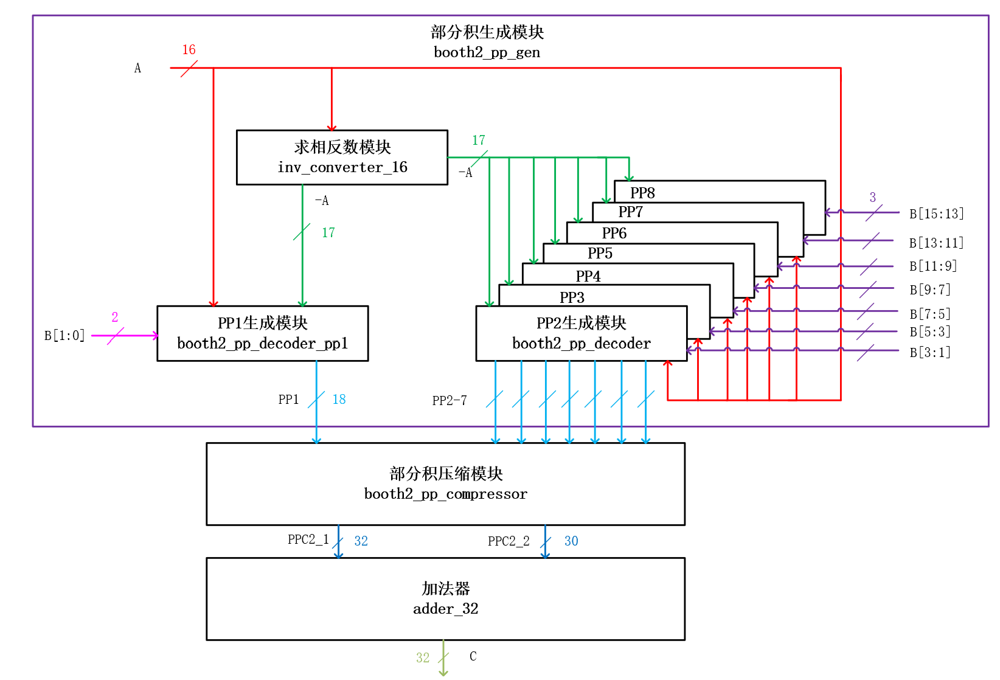

图1. 本设计乘法器的基本结构

### 基本原理

通常乘法运算包括三个主要的运算过程，分别是(1)部分积的产生:将“被乘数”乘以“乘数”，得到称为”部分积“的中间数据。（2）部分积压缩:使用特定的乘法器结构，将产生的多个部分积压缩到两个。（3）求和:使用加法器求压缩后的两个部分积的和，得到最终的乘积结果。本设计的部分积生成采用Radix-4 Booth乘数编码算法，而部分积压缩采用Wallace树型乘法器结构，部分积求和采用了混合半加器和全加器结构的经过优化的32位加法器，本章将简单介绍Radix-4 Booth算法和Wallace压缩方案的原理。

#### Radix-4 Booth算法原理

Radix-4 Booth乘数编码算法是一种用来减少部分积项数的算法，对于一个以 $n$位二进制补码形式表示的乘数`B`，其值为:

$$B=B[n-1] \times (-2^{n-1})+\sum_{i=0}^{n-2}B[i] \times 2^i \tag{1}$$

式(1)中， $B[i]$ 代表数据`B`的第i位的值。

本设计中乘法器输入的乘数 `B`是16位的，代入式(1)，则可以表示为:

$$\begin{align}
B&= -B[15]2^{15}+B[14]2^{14}+ \cdots +B[0]2^{0} \\
&= (-2B[15]+B[14]+B[13])2^{14} + (-2B[13]+B[12]+B[11])2^{12}+ \cdots + (-2B[1]+B[0]+B[-1])2^{0}\tag{2}
\end{align}$$
$$
\begin{align}
B &= -B[15]2^{15}+B[14]2^{14}+ \cdots +B[0]2^{0} \\
&= (-2B[15]+B[14]+B[13])2^{14} + (-2B[13]+B[12]+B[11])2^{12}+ \cdots + (-2B[1]+B[0]+B[-1])2^{0}\tag{2}
\end{align}
$$

其中B[-1]代表额外补充的乘数`B`的第"-1"位，这一位规定为0。将被乘数数据的相邻的三位 $\{B[i+1]，B[i]，B[i-1] \}$视为一个整体，则(2)式与(1)式相比，2的幂次项从16个减少到8个，从而`A`与`B`相乘后的部分积项数也从16个减少到8个，减少了后续为处理部分积的电路资源开销。

Radix-4 Booth编码与所对应的部分积操作之间的对应关系如表1所示，从表中可知，Radix-4 Booth编码方案中部分积操作数一共有五类，即`0`、`+A`、`+2A`、`-A`、`-2A`。其中，`0`是确定数 ，`+A`就是乘法器的输入，`+2A`直接由输入的`+A`数据左移一位得到，这些数据都是现有的。而对于`-A`、`-2A`的生成，将`-A`左移一位即可得到`-2A`，需要通过电路资源额外生成一个`-A`操作数。

表1. Radix-4 Booth乘数编码与部分积操作对照表

$$
\begin{array}{|c|c|c|}
\hline
{\{B_{i+1},B_{i},B_{i-1}\}}&{-2B_{i+1}+B_{i}+B_{i-1}}&{部分积操作}\\
\hline
{000}&{0}&{0}\\
\hline
{001}&{+1}&{A}\\
\hline
{010}&{+1}&{A}\\
\hline
{011}&{+2}&{2A}\\
\hline
{100}&{-2}&{-2A}\\
\hline
{101}&{-1}&{-A}\\
\hline
{110}&{-1}&{-A}\\
\hline
{111}&{0}&{0}\\
\hline
\end{array}
$$

举例来说，对于一个16bit*16bit有符号数的计算，假设乘数`B`为16'b1000_1000_1100_1110，被乘数`A`为16'b1000_1000_1100_1111，首先对乘数`B`进行分段，分段示意图如图2所示。

图2. 乘数分段过程示意图

完成乘数分段后，依据每一段乘数的3bit组合，得到对应的booth部分积操作数，然后将这些部分积操作数按照进行排列，将权值相同的数据位放在同一列，排列后的数据示意图如图3所示，接着再进行后续的部分积压缩、求和操作。图3中黑色数字代表部分积操作数，红色数字代表符号位扩展的位置。

从图3中可以看出，Radix-4 Booth乘法排列中，相邻的部分积操作数错开2位，而不是传统竖式乘法运算中的1位，这是由于(2)式中，相邻的2的幂次项的指数部分相差2，而在(1)式中相邻的2的幂次项的指数部分只相差1。

从图3中也可以发现，每个部分积操作数位宽都是18bit，因为一个 $n$位二进制补码的数据表示范围为 $[-2^{n-1}，2^{n-1}-1]$， 对于16位的补码来说，数据表示范围为 $[-32768，32767]$， 对于被乘数 $A=-32768$的情况，其相反数为-32768，这一值已经超出16位补码的表示范围，至少需要17位补码来正确表示，由此`-2A`则至少需要18位补码来正确表示，所以即使不考虑符号扩展位，部分积操作数的至少需要18位来表示。

图3. Radix-4 Booth竖式乘法运算过程示例

#### wallace乘法器基本原理

wallace乘法器是一种使用全加器、半加器等模块，将多个部分积进行压缩，最终输出2个部分积的一种乘法器结构。常见的部分积压缩方案有3:2压缩和4:2压缩，3:2压缩将输入的3个部分积压缩成2个部分积，4:2压缩将输入的4个部分积压缩成2个部分积。

一种常用的3:2压缩电路如图4所示，这一电路结构实际上是全加器，电路输入3个来自不同部分积的数据`i0`、`i1`、`ci`，最终输出压缩后的两个部分积的比特位`d`、`co`。

图4. 一种3:2压缩模块门级电路结构

一种常用的4:2压缩电路如图5所示，这一结构使用两个3:2压缩器级联得到。该电路结构输入4个部分积比特位`i0`-`i3`以及来自上一级压缩器的进位信号`ci`，最终生成2个压缩后的部分积比特位`d`和`c`，电路的进位输出`co`与进位输入`ci`无关，只要当`i0`、`i1`、`i2`确定，进位输出`co`就确定，不会造成进位链的传播。

图5. 一种4:2压缩模块的门级电路结构

使用4:2压缩模块将4个部分积压缩为2个的示例如图6所示，图中`PP1`-`PP4`为待压缩的4个部分积，`PPC1`、`PPC2`为压缩后的2个部分积，C为进位连线，将低位压缩电路的进位输出`co`和高位压缩器的进位输入`ci`连接起来。从图6中可见，对于某一特定权位进行4:2压缩时，压缩电路的三个输出只有`d`保留在原来的权值位置上，另外两个输出`co`和`c`要移动到更高1位的位置上。`co`和`c`是同权值的，理论上两者都可以连接到高位的压缩器的进位输入`ci`上，但结合前文对4:2压缩器的路径分析，进位输出`co`与进位输入`ci`无关，应该将低位的4:2压缩器的进位输出`co`连接到高位的进位输入`ci`上，这样才不会造成进位链传播的问题。

图6. 4:2压缩模块的使用示例

使用3:2压缩模块将3个部分积压缩为2个的示例如图7所示，与4:2压缩模块的使用示例相似，但3:2压缩模块使用时，相邻模块之间并没有进位连线，因为3:2压缩电路的进位输出`co`直接保留为压缩后的部分积，并不在相邻模块间传播。

图7. 3:2压缩模块的使用示例

### 本设计创新点

本设计在保证电路的关键路径长度满足一定限制的前提下，通过各种手段优化电路的逻辑资源用量，这些手段主要有:

1. 设计了一个特殊的低资源开销的"求相反数电路"，可以直接在进行部分积压缩之前生成`-A`、`-2A`这两个部分积操作数。

在传统的booth乘法器中，在进行部分积压缩前，首先生成被乘数的非( $\overline{A}$)，而“取反加一”后的( $\overline{A}+1$)才是原本需要用到的相反数`-A`，传统方法使用“加一补偿位”来处理部分积操作数为`-A`、`-2A`的情况，即将求相反数的“取反加一”操作的”加一“操作转移到部分积压缩过程中。

   带有补偿位的16bit*16bit乘法矩阵如图8所示，“加一补偿位”的存在使得每个部分积的低位的下方都增加了1位补偿位，需要对低位使用部分积压缩电路。同时，部分积个数变成了9个，需要额外的电路处理这一个多出来的部分积，而在本设计中没有这些补偿位，低位数据可以不经过压缩直接保留，也没有多出来的一个部分积，不仅节约了电路资源，也缩短了潜在的关键路径。

   虽然为了在部分积操作数产生过程中直接得到`A`的相反数`-A`，也需要额外的“求相反数”单元，有额外的资源开销，本设计对这一单元进行了优化，使用尽可能少的逻辑资源来实现求相反数的功能。经过测试，本设计先求相反数的方法比“加一补偿位”方法使用的资源量更少。

   

   
图8. 传统booth乘法器的乘法矩阵

2. 在部分积压缩过程中，利用不同权值位置上的数据规律，设计了特殊的压缩模块，减少了逻辑资源的开销和模块关键路径的长度。

3. 使用其它门电路结构来搭建”异或门“、”同或门“等效电路，使得”等效异或门“、”等效同或门“的中间运算数据可以复用，减少了电路逻辑资源开销。

4. 使用符号位编码方案，减少了每一个部分积的符号扩展位数，从而减少了压缩模块的使用量。此外，依据所采用的符号位编码的特点，对部分积生成模块和部分积压缩模块进行联合优化，更进一步减少了逻辑资源使用量。

有关设计细节和优化方案将在下一章进行详细描述。

### 设计详解

本设计整体结构可以分为3大部分，分别是:

- 部分积操作数生成
- 部分积压缩
- 部分积的求和

本章将对三大部分的设计细节进行解释和说明。

#### 部分积操作数生成

本设计中，部分积生成模块`boot2_pp_gen`输入数据为16bit的被乘数`A_NUM`和乘数`B_NUM`，输出8个Radix-4 Booth乘数编码算法产生的18bit部分积操作数`PP1`-`PP8`。

分析部分积生成过程，发现其中存在着如下的规律:

1. 在16bit*16bit有符号数乘法中，Radix-4 Booth编码方案需要得到`0`、`A`、`-A`、`2A`及`-2A`一共五种18bit部分积操作数，通过观察这五种操作数的规律，可以发现:

   1. `A`、`-A`使用17bit表示就已足够表示 $[-32768,32768]$，这两个操作数的18bit表示中，最高位与次高位相同，所以在运算得到`A`、`-A`时，只需要处理低17位数据。同时`2A`、`-2A`的最低位一定是0，运算得到`2A`、`-2A`时，无需考虑最低位的生成，所以部分积操作数的最高位和最低位，相比于其他位置上的数据，可以使用更为简单的电路产生。
   2. `2A`可以由`A`左移一位得到，`-2A`可以由`-A`左移一位得到，而`A`直接由输入得到。因此，对于5类部分积操作数，只需要通过额外的电路计算`-A`，就能得到全部的5类部分积操作数。由于8个部分积操作数的生成过程都有可能用到`-A`，因此，可以设计一个专用的计算`-A`的电路模块`inv_converter_16`，其计算的结果作为中间数据，分为8路输入到多个部分积操作数解码模块`pp_decoder`，实现`-A`数据的复用。
2. Radix-4 Booth编码方案中，对于第一个部分积操作数的生成，乘数编码的最低位(`B[-1]`)一定是0，相比其他位置，可以使用更为简单的编码电路实现Booth编码，减少了电路逻辑资源开销。

##### 求相反数模块设计与优化

由上述规律1.2，需要设计一个电路来得到17bit数据源`-A`，从`A`到`-A`，在补码表示中就是“按位取反，末位加一”的过程。传统的17bit”取反加一“电路如图9所示，该结构与“先取反，再加一”的过程对应，使用了15个半加器模块。

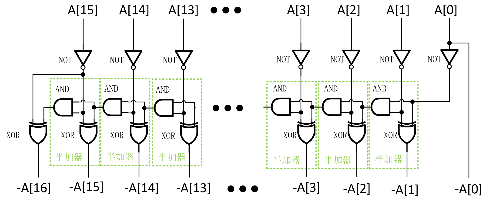

图9. 传统取反加一模块结构示意图

通过逻辑化简，消去图9中输入端的非门，得到新的”取反加一“电路结构如图10所示，该结构的基本组成单元为"取反单元"，逻辑化简后相比优化前的电路，减少了16个非门(NOT)所用的CMOS管数量。

图10. 逻辑化简后的取反加一模块结构示意图

从逻辑化简后的结构出发，更进一步进行化简，图10中每个“取反单元”都由一个异或门(XOR)和一个或门(OR)组成，对于一个`A`与`B`的异或运算，有(3)式:

$$A \oplus B=\overline{A}B+A\overline{B}=(A+B) \cdot \overline{AB} \tag{3}$$

在(3)式最右侧，出现了 $A + B$，即`A`与`B`的或运算，这一结果可以用作或门(OR)的运算结果，实现数据复用，进行优化后的“取反单元”的电路如图11所示，该结构相比图10中的取反单元减少了2个CMOS管，也就是2分资源代价。

图11. 优化后的取反单元

使用经过优化后的取反单元，并将其称为`inv_unit`，得到优化后的求相反数电路如图12所示。

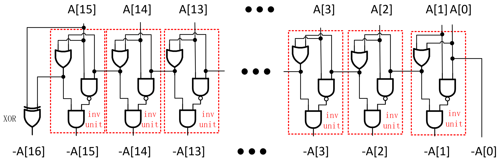

图12. 使用优化后的取反单元搭建的求相反数模块

可以对图12中的结构进行进一步优化，求相反数模块在最高位异或门附近的电路细节如图13所示。

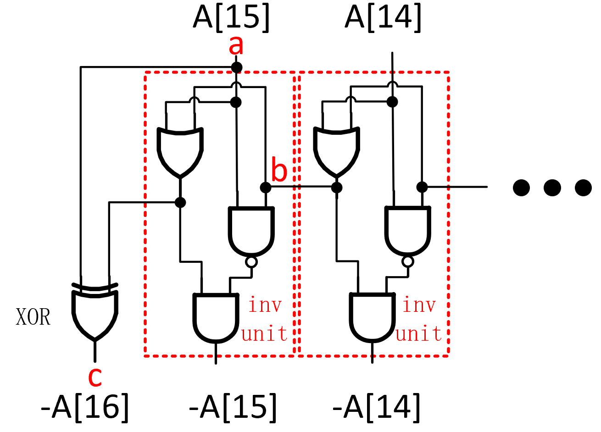

图13. 求相反数模块高位细节

对于`-A[16]`，即图13中的`c`，其逻辑表达式如(4)式：

$$c=a \oplus(a+b)=\overline{a}b=\overline{a+\overline{b}} \tag{4}$$

若能得到 $\overline{b}$，就可以只用一个或非门(NOR)替代原来的异或门，如图14所示。

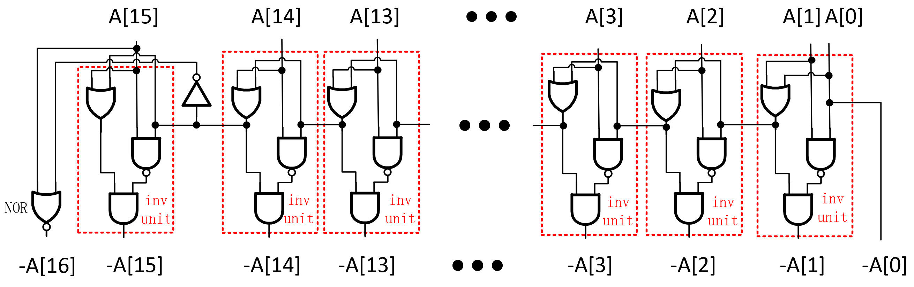

图14. 消去最高位异或门后的“求相反数”模块

与(3)式类似，两个数`A`和`B`的异或运算还可以表达为(5)式:

$$A \oplus B=\overline{A}B+A\overline{B}=\overline{\overline{A+B}+AB} \tag{5}$$

实现该异或运算的电路如图15所示，在这一异或运算电路中使用14个CMOS管，而(3)式结构中使用16个COMS管，可见资源使用量有所下降。

图15. 一种异或运算电路

若将这一结构取代最高位、次高位的取反单元`inv_unit`，可得到等效的输出结果。最终经过优化后的求相反数的电路结构如图16所示，这是本设计最终采用的“取反加一”模块的电路结构，其资源开销较小，一共使用242个COMS管。

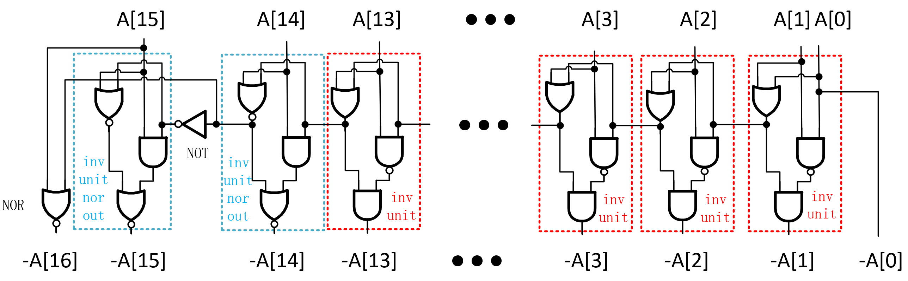

图16. 本设计的求相反数模块电路结构

##### booth编码器设计与优化

由前文规律1.1及1.2，在Radix-4 Booth算法中，一个部分积操作数`ppx`的数据来源有三类，即`A`、`-A`、`0`，另外两个部分积操作数`2A`、`-2A`都是这些数据源的进行左移操作后的变体。

###### 通用booth编码器的设计与优化

本设计依据booth算法的原理，设计三个编码信号，`flag_s1`、`flag_s2`和`flag_2x`。其中`flag_s1`、`flag_s2`的组合来选择数据来源`pp_source`，接着通过`flag_2x`标志信号决定数据源是否需要左移操作，以生成最终的18bit部分积操作数，3个标志信号的真值表如表2所示。

表2. 标志信号的真值表

$$
\begin{array}{|c|c|c|c|c|}
\hline
{\{B_{i+1},B_{i},B_{i-1}\}}&{flag\\_2x}&{flag\\_s1}&{flag\\_s2}&{部分积操作数}\\
\hline
{000}&{1}&{0}&{0}&{0}\\
\hline
{001}&{0}&{0}&{1}&{A}\\
\hline
{010}&{0}&{0}&{1}&{A}\\
\hline 
{011}&{1}&{0}&{1}&{2A}\\
\hline
{100}&{1}&{1}&{0}&{-2A}\\
\hline
{101}&{0}&{1}&{0}&{-A}\\
\hline
{110}&{0}&{1}&{0}&{-A}\\
\hline
{111}&{1}&{0}&{0}&{0}\\
\hline
\end{array}
$$

由表2，可以得到 $flag\_2x$的逻辑表达式为式(6):

$$flag\_2x=B_{i} \odot B_{i-1} \tag{6}$$

 $flag\_s1$的逻辑表达式为式(7):

$$flag\_s1=\overline{\overline{B_{i+1}}+B_{i}B_{i-1}}\tag{7}$$

 $flag\_s2$的逻辑表达式为式(8):

$$flag\_s2=\overline{B_{i+1}+\overline {B_{i} + B_{i-1}}}\tag{8}$$

结合以上逻辑表达式，可以使用图17中所描述的电路结构来进行Radix-4 booth编码，该电路的CMOS管数量为32。

图17. Radix-4 booth编码电路基本结构

考虑到图17中结构用到了同或门(XNOR)，使用等效的同或门结构来实现“同或”运算，则其中间运算数据可以实现复用，可以减少CMOS管数量。

两个数`A`和`B`的同或运算可以表达为(9)式，由此构建的等效“同或门”结构如图18所示。

$$A \odot B = \overline{A}\ \overline{B} + A\ B =\overline{\overline{\overline{A+B}+AB}}\tag{9}$$

图18. 等效同或门结构

使用等效的“同或门”取代图17中的同或门，并复用与门和或非门的输出信号，可以得到优化后的booth编码电路如图19所示，这一电路的MOS管数量为26，相比图19中电路的资源开销更少，这一电路结构中， $flag\\_2x$的输出端使用“NOR门+NOT门”的形式进行构建，而不是直接使用逻辑资源相等但性能代价更小的 OR门，这是由于后续部分积操作数生成过程中，需要用到 $\overline{flag\\_2x}$，NOR门输出端就是 $\overline{flag\\_2x}$，可以直接实现复用。

图19. 优化后的Radix-4 booth编码电路结构

###### 低位booth编码器的设计

Radix-4 Booth编码方案中，乘数编码的最低位(`B[-1]`)一定是0，对于权值最低的部分积的生成，可以使用更为简单的Booth编码电路，3个控制信号`flag_s1`、`flag_s2`和`flag_2x`与最低位的乘数编码的真值表如表3所示。

表3. 最低权值部分积的控制信号真值表

$$
\begin{array}{|c|c|c|c|c|}
\hline
{\{B_{1},B_{0}\}}&{flag\\_2x}&{flag\\_s1}&{flag\\_s2}&{部分积操作数}\\
\hline
{00}&{1}&{0}&{0}&{0}\\
\hline
{01}&{0}&{0}&{1}&{A}\\
\hline
{10}&{1}&{1}&{0}&{-2A}\\
\hline
{11}&{0}&{1}&{0}&{-A}\\
\hline
\end{array}
$$

由表3，可以得到 $flag\\_2x$的逻辑表达式为式(10):

$$flag\\\_2x=\overline{B_{0}} \tag{10}$$

$flag\\_s1$的逻辑表达式为式(11):

$$flag\\\_s1=B_{1}\tag{11}$$

$flag\\_s2$的逻辑表达式为式(12):

$$flag\\\_s2=\overline{B_{1}+\overline {B_{0}}}\tag{12}$$

结合逻辑表达式(10)-(12)，可以使用图20中的电路结构来进行Radix-4 booth编码，该电路的CMOS管数量为6。

图20. 乘数低位所用的booth编码电路

##### booth译码器设计与优化

在编码电路完成三个编码信号`flag_s1`、`flag_s2`和`flag_2x`的编码后，利用这3个编码值作为译码器的输入，译码得到部分积操作数。

###### 数据源生成

在本设计中，`flag_s1`、`flag_s2`共同决定部分积操作数的17bit数据源，`flag_s1`、`flag_s2`与输出的部分积操作数数据源的对应关系如表4所示。

表4. 控制信号与部分积数据源的关系

$$
\begin{array}{|c|c|c|}
\hline
{flag\\_s1}&{flag\\_s2}&{部分积操作数数据源}\\
\hline
{0}&{1}&{A}\\
\hline
{1}&{0}&{-A}\\
\hline
{0}&{0}&{0}\\
\hline
\end{array}
$$

对于数据源的三种情况(`A`、`-A`、`0`)，定义一个17bit的中间变量`pp_source`，其第逻辑表达式为(13)式:

$$pp\\_source[i] = flag\\_s1 \cdot (-A[i])+flag\\_s2 \cdot (A[i]),\ \ \ 0 \leq i \lt 17 \tag{13}$$

实现这一个逻辑表达式的电路结构如图21所示，该电路实际上是一个”与或非门”，通过这一电路得到的`pp_source`实际上就是`A`、`-A`、`0`按位取反后的值。后续电路将直接利用这个取反后的数据，以达到节省电路资源的目的，这点将在下文进行说明。

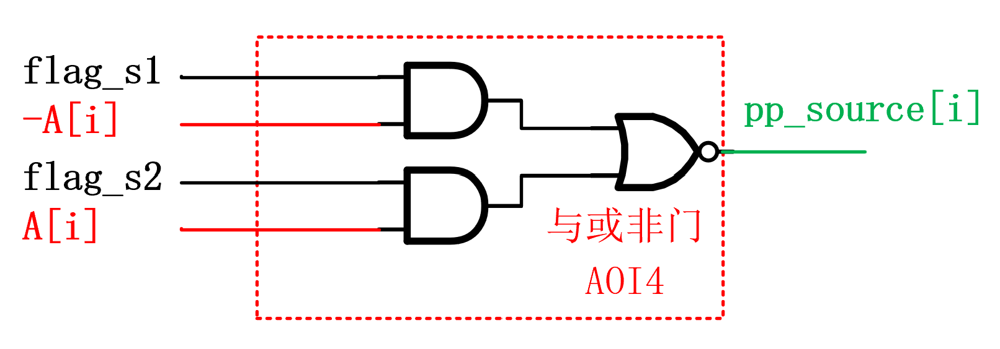

图21. 部分积操作数数据源选择电路

######  移位判决

当部分积操作数数据源确定后，下一步需要确定数据源`pp_source`是否需要左移操作。由于前面电路生成的数据源`pp_source`是真实操作数据按位取反的数据，则对于输出部分积操作数`ppx`的第`i`位，有两种可能:
1. 需要移位，即 $ppx[i]=\overline{pp\\_source[i-1]}$，此时 $flag\\_2x$编码值为1。
2. 不需要移位，即 $ppx[i]=\overline{pp\\_source[i]}$，此时 $flag\\_2x$编码值为0。
实现这一操作数生成过程的电路实际上就是一个2选1数据选择器(MUX)，通过`flag_2x`信号来确定输出数据，`ppx[i]`的逻辑表达式如式子(14)所示。

$$ppx[i] = \overline{flag\\_2x \cdot pp\\_source[i-1] +  \overline{flag\\_2x} \cdot pp\\_source[i]} \tag{14}$$

表达式(14)使用”与或非门”即可实现，其电路结构如图22所示。

图22. 部分积移位判决电路

###### MSB和LSB的移位判决电路优化

分析输出部分积的最低位`ppx[0]`，当 $flag\\_2x=1$时，代表部分积操作数为`2A`，`-2A`，这种情况下，`ppx[0]`一定是0，由此，`ppx[0]`的逻辑表达式可以写为(15)式:

$$ppx[0]=\overline{flag\\_2x} \cdot \overline{pp\\_source[0]}=\overline{flag\\_2x+pp\\_source[0]} \tag{15}$$

使用一个或非门(NOR)即可实现移位判决功能，减少了CMOS管数量和潜在的关键路径长度。

分析输出部分积的最高位`ppx[17]`，将 $i=17$代入(14)式，有(16)式:

$$ppx[17] = \overline{flag\\_2x \cdot pp\\_source[16] +  \overline{flag\\_2x} \cdot pp\\_source[17]} \tag{16}$$

生成的部分积数据源`pp_source`实际上是17bit的，$pp\_source[17]$是 $pp\_source$的符号位扩展，故      $pp\_source[17]=pp\_source[16]$，因此(16)式可以改写为(17)式，直接使用一个非门即可实现数据输出。

$$ppx[17] = \overline{flag\\_2x \cdot pp\\_source[16] +  \overline{flag\\_2x} \cdot pp\\_source[16]}=\overline{pp\\_source[16]} \tag{17}$$

实际上本设计并未直接直接令 $ppx[17]=pp\\_source[16]$，而不是(17)式中的取反，因为后续部分积压缩中，部分积`pp2`-`pp8`都没有用到部分积操作数的符号位 $ppx[17]$，而是用到了其符号位的取反 $\overline{ppx[17]}$，直接在部分积生成时产生这个符号位的反，同时减少了移位判决电路和后续电路中的非门。

综合以上分析，一个完整的Booth编译码电路如图23所示，将这一模块重复叠加7个，即可得到`pp2`到`pp7`共计7个部分积操作数。

图23. pp2-pp8的booth编解码电路

对于权位最低的部分积操作数`pp1`，其booth编码电路更加简单，其booth编解码电路如图24所示。

图24. pp1的booth编解码电路

由于每个部分积生成过程中，用到的数据源`-A`都是一样的，故只要使用一个“取反加一模块”，加上这一个复用的“取反加一模块”，则`pp2`-`pp8`的整体生成电路如图25所示。

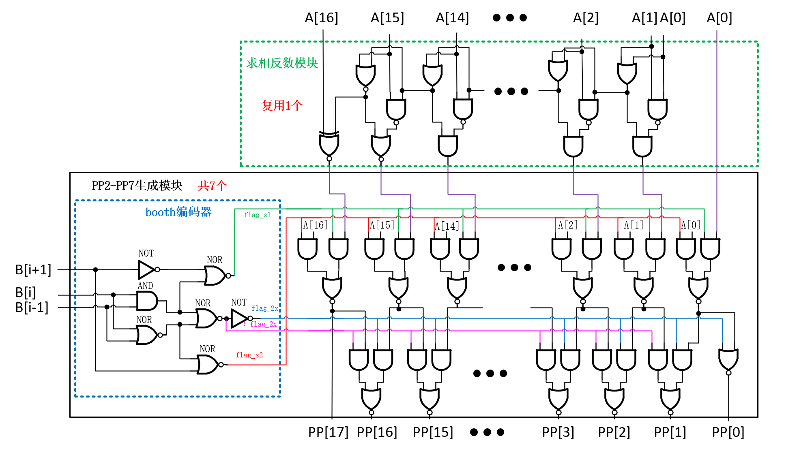

图23. pp2-pp7生成模块示意图

对于权位最低的部分积操作数`pp1`，其booth编码电路比其他7个编码电路简单，其部分积操作数生成模块全局电路如图24所示。

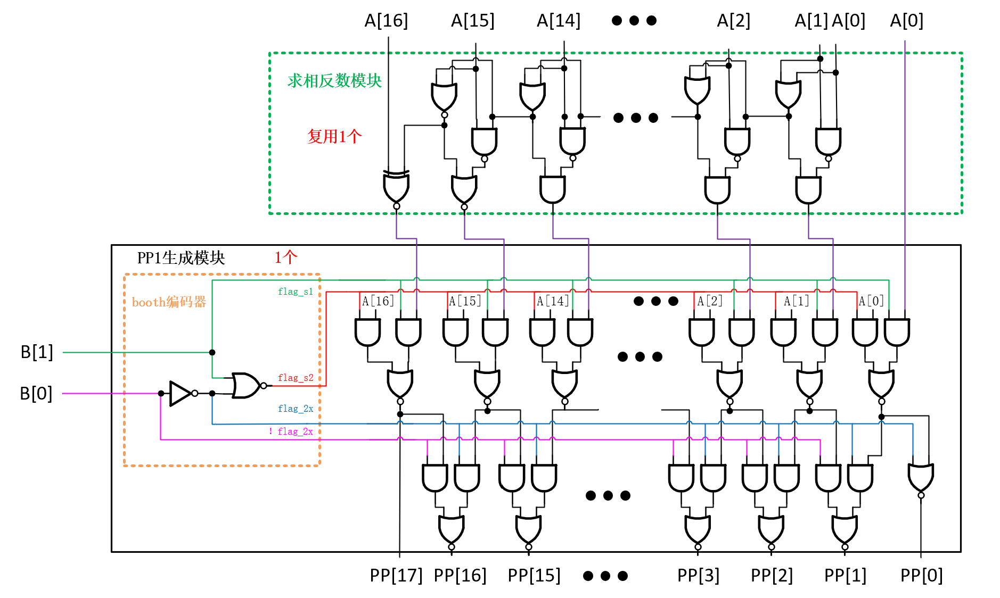

图24. pp1生成模块示意图

#### 部分积压缩

部分积压缩模块`booth2_pp_compressor`输入8个部分积操作数`pp1`-`pp8`，最终得到两个压缩后的部分积输出`PPC2_1`、`PPC2_2`。本章将详细介绍所设计的乘法器的部分积压缩过程。

##### 部分积符号位变换

传统的Radix-4 Booth算法得到的部分积矩阵图如图25所示，图中红色圆点代表部分积的符号位扩展，图25中同一行部分积的红色圆点代表的数据都是一样的，为了减少部分积的位宽，可以对符号位进行变换。

 
图25. 传统Radix-4 Booth乘数编码方案的部分积矩阵

假设第 $i$各部分的符号位为 $S_i$ ，其中 $i$ 为0-7，对于图25中的符号位，将这些符号位扩展对应的数值相加，其值为(18)式:

$$\begin{align}
sign&= \sum_{i=0}^{7} S_{i}\sum_{j=2i+15}^{31}2^j \\
&= \sum _{i=0}^{7}[(1-\overline{S_i})(2^{32}-2^{2i+15})] \\
&= \sum _{i=0}^{7}(\overline{S_i} \cdot2^{2i+15}) +10923 \times2^{17} \tag{18}
\end{align}$$

(18)式中，`10923`为二进制`10101010101011`， 则 $1092 3 \times2^{17}$相当于在原先产生的部分积的第17、18、20、22、24、26、28、30位填充1，则符号位的值 $\sum_{i=1}^{8}(\overline{S_i} \cdot2^{2i+15})$的矩阵阵列如图29所示。

 
图29. 符号位编码后的数据及其所在位置

图29中的符号位编码，与原来的部分积操作数`ppx`的非符号位存在重叠，无法直接加到原来的乘法矩阵中，一种整合方案是将`pp3`-`pp8`所补充的`1`移动到上一个部分积中，其位置重排示意图如图30所示，图例说明是对应的解释。

 
图30. 符号位编码位置重排示意图

从图30中可见，`pp2`符号编码补充的`1`，无法直接移动到`pp1`所在的行上，若将`pp2`的1与第一行的“符号位取反”进行二进制加法，有(19)式，式中下标 $b$代表数据都是以二进制表达的。

$${11}\_{b}+ (\overline{S})_{b} = (\overline{S}SS)_b \tag{19}$$

结合(19)式，将移动后的符号编码整合到原来的部分积上，乘法矩阵变成如图31所示的结构，图例说明是对应的解释。图31中只有`PP1`经过符号位编码后用到了原始符号位(红点)，其他7个部分积`PP2`-`PP8`都没有使用原来部分积操作数的符号位，而是使用符号位的反(黄点)来替代原来的符号位。

若部分积生成时，能直接产生“符号位的取反”，则在符号编码时可以减少非门(NOT)的资源开销，这照应了前文所述，在部分积生成时直接生成符号位的反逻辑，这也是本设计的一个优化细节。

 
图31. 采用符号位编码后的乘法矩阵点图

##### Wallace树结构
本设计采用Wallace Tree结构来进行部分积压缩，构建的Wallace树的结构如图32所示，使用两级4:2压缩过程，共计3个4:2压缩过程来得到最终的两个部分积。第一级的两个4:2压缩过程是并行进行的，压缩完成后再接着进行第二级4:2压缩。每个“4:2压缩“过程由多个“4:2压缩器模块”和若干”3:2压缩模块“组成，有关这些“压缩模块”的细节将在下文进行详细解释。

图32. 本设计Wallace树结构

##### 部分积压缩过程详解

本设计Wallace树结构中，每个4:2压缩过程实际上是多种“4:2压缩器”和“3:2压缩器”的组合。在前文所述”符号位编码“中，数据排列具有一定规律性，出现了很多固定输入值为0或者1的位置，本设计依据这一规律进行了优化，对应的电路实现方案以及部分积压缩过程将在本节进行详细说明。

###### 标准压缩电路的设计与优化

对于"4:2压缩器"和”3:2压缩器“这两种基本的压缩器的设计与优化，这两种压缩器的一种常用的电路结构已经在图4、图5中展示过。为了方便读者阅读，现再次展示这两种结构，常用的3:2压缩电路如图33所示。

图33. 传统3:2压缩模块

结合图33，3:2压缩模块的进位输出`co`的逻辑表达式可以化为(20)式:

$$co=i_0i_1+(i0 \oplus i_1)c_i=\overline{\overline{i_0i_1}\ \ \  \overline{(i0 \oplus i_1)ci}} \tag{20}$$

式(20)中，中间变量 $\overline{i_0i_1}$的产生由 $i_0$、 $i_1$经过与非(NAND)得到，而 $i_0$、 $i_1$是第一级异或门(XOR)的两个输入。同样地，中间变量 $\overline{(i0 \oplus i_1)ci}$的产生由 $i0 \oplus i_1$、$ci$经过与非(NAND)得到，而 $i0 \oplus i_1$、$ci$恰好也是第二级异或门(XOR)的两个输入。若能实现一个等效的“异或门”实现原来3:2压缩器中异或门(XOR)的功能，其中间数据若有输入的与非(NAND)，则可以实现数据复用。

假设异或门的输入分别为 $i_0$、 $i_1$，则“异或”的逻辑表达式可以化为(21)式:

$$i_0 \oplus i_1 = \overline{i0}i_{1}+i_{0}\overline{i1}=\overline{\overline{\overline{i_0i_1}i_0+\overline{i_0i_1}i_1 }}\tag{21}$$

在式(21)中， $\overline{i0 i_1}$是异或运算的中间变量，同时出现在(21)、(20)式中，可以实现数据复用。

利用这一思路，优化后的3:2压缩器的电路结构如图34所示。

图34. 优化后的3:2压缩模块

常用的4:2压缩电路如图35所示，该结构由两个3:2压缩器级联得到，其进位输出`co`与进位输入`ci`无关。

图35. 传统4:2压缩模块

以相同的连接方式，将经过优化后的3:2压缩模块级联，即可得到优化后的4:2压缩模块，其电路结构如图36所示。

图36. 优化后的4:2压缩模块

###### 第一级第一次压缩过程详解

对于booth算法生成的4个经过“符号编码”后的部分积`pp1`-`pp4`，其经过”4:2压缩过程"得到两个压缩后的部分积`ppc1`、`ppc2`，这一过程的乘法矩阵如图37所示，可以观察到如下规律:

图37. 前四个部分积压缩过程 

1. 位置索引为3:0的权位有效的部分积数据不到两行，矩阵图空白的地方都是0，天然就是两个部分积，无需处理即可作为压缩后部分积的输出。
2. 位置索引为5:4的位置，有效的部分积输入是3个，使用2个3:2压缩模块即可生成`PPC1`和`PPC2`。
3. 位置索引6上使用的“4:2压缩模块”没有进位输入`cin`，因为位置索引5上使用的3:2压缩模块的进位输出`co`直接保留到压缩结果`PPC2`上，而不是连接到位置6上的“4:2压缩模块”的进位输入端。 
4. 位置索引20位置上的“4:2压缩模块”有2个确定的输入，即来自`PP1`的0和来自`PP2`的1。
5. 位置索引21上的“4:2压缩模块”只有3个有效输入信号，即来自上级压缩器的进位输入`cin`、来自`pp3`、`pp4`的数据，使用3:2压缩器即可实现部分积压缩，且3:2压缩器进位输出信号`co`直接保留到`PPC2`，不会造成进位链延长的问题。
6. 位置索引22上的“4:2压缩模块”只有2个有效输入，即来自`pp4`的数据和`pp3`上的1，实际上就是将`pp4`的对应数据"加1"保留到`PPC1`，并产生进位信号到`PPC2`的过程，一位二进制数“加1”的结果实际上就是求反，使用非门(NOT)即可产生`PPC1`。一位二进制数“加1”的进位信号就是数据本身，将`PP4[22]`直接连接到`PPC2`的位置索引23的位置上。
7. 位置索引23、24位置上的有效部分积项数不超过2个，可以直接保留。

结合以上规律，本设计第一级压缩处理`pp1`-`pp4`的过程如图38所示，有关说明可以参见图例，需要格外注意的是`PPC2`在索引位置4处固定为0，更低的权位没有用到压缩器，也没有数据保留到这一位置。

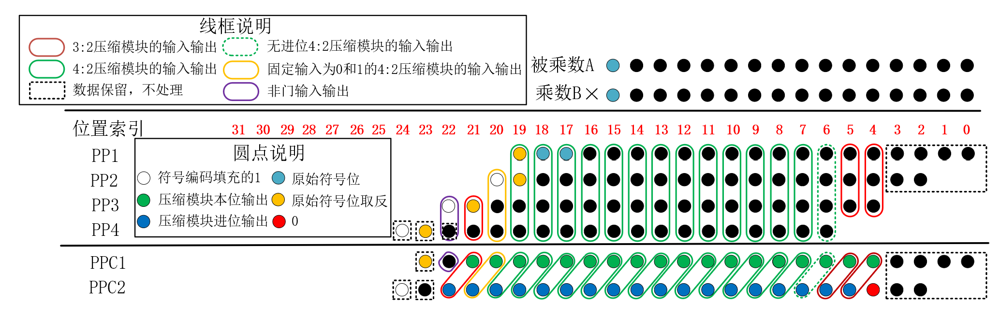

图37. 前四个部分积压缩过程所用模块示意图

对于图37中位置索引为6的位置上使用的“无进位4:2压缩模块”，不考虑进位时，即令4:2压缩模块的进位输入`ci`为0，此时4:2压缩电路可以化简成图38所示电路。该电路的后半部分等效为半加器。

图38. 不考虑进位输入的4:2压缩器变体

对于半加器电路，假设半加器输入的两个数据分别为 $a$、 $b$，则图38中半加器输出端 $d$的逻辑表达式可以表示为(22)，可见求和本质上是异或运算。

$$d=\overline{\overline{a+b}+ab} \tag{22}$$

半加器进位输出 $c$的表达式为(23)式:

$$c=ab\tag{23}$$

(22)式和(23)式存在公共的运算 $ab$，则可以复用这一数据，优化后的半加器电路如图39所示。

图39. 经过优化后的半加器电路

将图38中的“无进位输入的4:2压缩器”中的半加器用图39中优化后的半加器替代，则得到优化后的“不考虑进位输入的4:2压缩器”，如图40所示。

图40. 优化后的“无进位4:2压缩器”电路

对于图37中位置索引为6的位置上使用的“固定输入为0和1的4:2压缩模块”，令原来图36中的输入端`i0`为0，`i2`为1，则原来的4:2压缩器变为如图41的电路结构，与传统4:2压缩器比较可知，4:2压缩器的第一级3:2压缩器被一个非门(NOT)取代。

图41. 固定输入为0和1的4:2压缩模块

###### 第一级第二次压缩

对于booth编码算法生成后4个符号编码后的部分积`pp5`-`pp8`，其经过”4:2压缩过程"得到两个压缩后的部分积`ppc3`、`ppc4`，这一过程的部分积乘法矩阵如图42所示，可以观察到如下规律:

图42. 后四个部分积压缩过程 

观察图42中编码后的数据，可以发现对于后四个部分积`PP5`-`PP8`，其数据分布存在以下规律:

1. 位置索引26上的“4:2压缩模块”有一个确定的输入，即来自`PP5`的1，可以为这个确定的输入设计专用的“4:2压缩模块“，节省电路资源开销。
2. 位置索引27上的“4:2压缩模块”有一个确定的输入，即来自`PP5`的0(图40的空白部分)，同样可以设计专门的模块进行部分积压缩。
3. 位置索引28上的“4:2压缩模块”有确定的两个输入0和1，可以使用前文提到的"固定输入为0的4:2压缩模块"进行部分积压缩，这一结构如图41所示。
4. 位置索引29上只有3个有效输入信号，直接使用“3:2压缩模块”即可完成部分积压缩。
5. 位置索引30上的“4:2压缩模块”只有两个有效输入，即来自`PP8`的数据和`PP7`上的`1`，与部分积`PP1`-`PP4`的压缩过程类似，使用非门即可进行部分积“压缩”。
6. 位置索引31位置上的部分积数据位不超过两个，可以直接保留。

结合以上规律，本设计第一级压缩处理`PP5`-`PP8`的过程如图43所示，有关说明可以参见图例，需要格外注意的是`PPC4`在索引位置12处为0，因为更低的权位没有用到压缩器，也没有数据保留到这一位置，后续求和模块将利用这一规律优化结构。

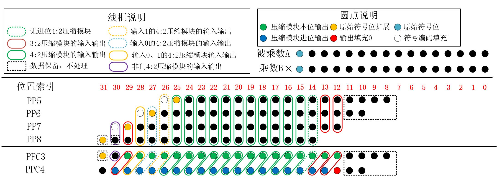

图43. 后四个部分积压缩过程所用模块示意图

对于图43中使用的“输入为0、1的4:2压缩模块”以及“无进位4:2压缩模块”，上一小节已经提到，此处不再提。

对于图43中位置索引26上使用的“输入为1的4:2压缩模块”，令图36的“标准4:2压缩模块”的`i2`为1，则4:2压缩模块变换为图44的电路结构。结合前文分析，这个变换后的4:2压缩的前半部分是图34的“等效异或门”少一个输出端的非门，即实际上变为“等效同或结构”。

图44. 固定输入为1的4:2压缩模块的一种变体

在图44中，进位输出`co`的表达式为(24)式:

$$co=\overline{\overline{i_0i_1} \cdot (i_0 \odot i_1)}=i_0i_1+\overline{i_0 \odot i_1}\tag{24}$$

(24)式通过逻辑化简，进位输出`co`可以化为(25)式。

$$co=i_0+i_1\tag{25}$$

对于图42的“等效同或结构”的运算，有(26)式，(26)式与(25)式有公共的运算 $i_0+i_1$，则可以进行数据复用。

$$i_0\odot i_1=i_0\cdot i_1+\overline{i_0}\cdot\overline{i_1}=\overline{\overline{i_0i_1}(i_0+i_1)}\tag{26}$$

(26)式所描述的“等效同或结构”如图45示。

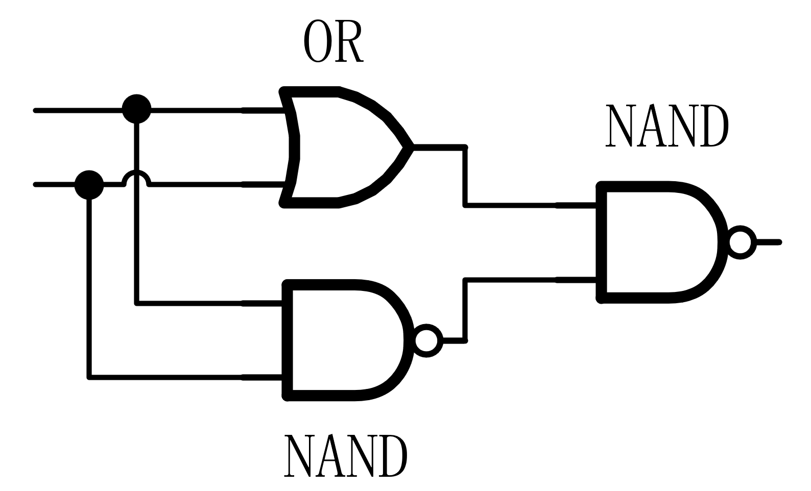

图45. 同或运算电路的一种变体

用图45的同或运算电路取代图44的前半部分，并复用 $i_0+i_1$数据，得到优化后的“固定输入为1的4:2压缩器”如图46所示。

图46. 优化后的固定输入为1的4:2压缩模块

对于图43中位置索引27上使用的“固定输入为0的4:2压缩模块”，令图36中的“标准4:2压缩模块”的`i0`为0，则4:2压缩模块变换为图47中所示的电路结构。结合前文分析，这个变换后的4:2压缩的前半部分是图34中的“等效异或门”。

图47. 固定输入为0的4:2压缩模块的一种变体

由图47可知，进位输出`co`的表达式为(27):

$$co=i_1i_2\tag{27}$$

使用图15中的等效异或门结构取代图47中的“等效异或结构”，该异或运算电路存在中间运算数据 $i_1i_2$，由此可以直接得到`co`，经过优化后的结构如图48所示。

图48. 优化后的固定输入为0的4:2压缩模块

###### 第二级压缩

经过前两小节所述的第一级的两次压缩后，得到4个部分积`PPC1`、`PPC2`、`PPC3`、`PPC4`，第二级压缩需要将这4个部分积压缩成最终的两个部分积`PPC2_1`和`PPC2_2`，其压缩过程的数据矩阵如图49所示。图中位置索引为24处的白色圆点代表由符号编码补充的1，这一数据在第一级压缩中没有处理，直接保留。图中红色圆点代表0，由于在第一级压缩时没有数据赋值到这两个位置，故当成是0。

图49. 第二级压缩过程数据矩阵

观察图49中矩阵，可以发现如下规律:

1. 在位置索引7-0上本身就是两个部分积，因此直接保留到`PPC2_1`、`PPC2_2`即可。
2. 在位置索引9-8上，同一权值上只有三个有效数据输入，使用“3:2压缩器”即可将部分积压缩为2个，其电路结构如图34所示。
3. 在位置索引10上，没有来自位置索引9处的压缩器的进位输入，有效输入数据只有4个，使用“无进位输入的4:2模块”，其电路结构在图40中已经展示。
4. 在位置索引12上，`PPC1_4`为0，因此也可以使用“无进位输入的4:2模块”，其电路结构见图40。
5. 位置索引24上的“4:2压缩模块”有确定的两个输入0和1，使用上文提到的“ 固定输入为0和1的4:2压缩模块”，其电路结构见图41。
6. 位置索引25上只有三个有效数据，使用3:2压缩模块即可达到压缩成两个部分积的目的，其电路结构在图34中已经展示。
7. 位置索引30:26上只有两个有效数据，使用半加器即可实现"4:2"压缩，这里半加器的进位保留到`PPC2_2`，而不是输出到平行的模块，不产生进位链延长的问题。
8. 位置索引31上的压缩器，无需考虑进位输出，产生同权值位的数据`PPC2_1`即可，使用一个异或门(XOR)对`PPC3`、`PPC4`进行异或运算即可得到。

综上分析，第二级压缩过程如图50所示。

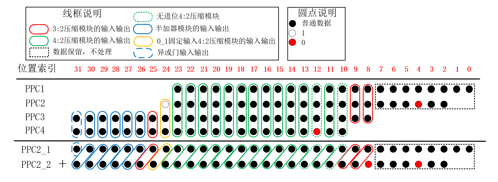

图50. 第二级部分积压缩所用模块示意图

综合本节对部分积压缩的过程的分析，两级部分积压缩的全流程中，所用的模块如图51所示。

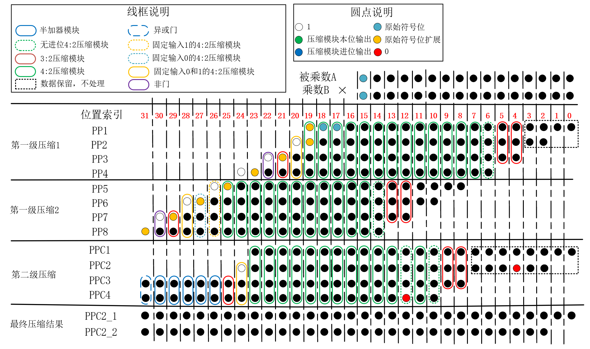

图51. 部分积压缩全流程示意图

#### 部分积求和

在构建wallace tree进行部分积压缩后，得到两个压缩后的部分积`PPC2_1`和`PPC2_2`，需要将这两个部分积通过加法器进行求和得到最终的乘法器的输出`C_NUM`。
常用的加法器结构有行波进位加法器和超前进位加法器，超前进位加法器逻辑资源开销大，但不会造成进位链延长，关键路径较短。行波进位加法器存在进位信号的级联线，因此关键路径较长，但资源开销较小。
考虑到本设计压缩部分低位数据基本都是直接保留，并未经过过多的额外电路，中间位置数据使用4:2压缩器关键路径并没有非常长，因此本设计以尽可能少的资源为首要目标。
两个压缩后的部分积`PPC2_1`和`PPC2_2`，其加法矩阵如图52所示。

图52. 部分积加法矩阵

观察图52中点阵，可以发现如下规律:

1. 在位置索引为1:0的地方只有一个数据`PPC2_1`，因此无需处理，直接作为输出。
2. 在位置索引为2的地方，只有两个有效数据，即`PPC2_1`和`PPC2_2`，使用半加器即可完成加法运算。
3. 在位置索引为4、8的位置，数据位存在固定的0，实际上只有两个有效数据，即`PPC2_1`和来自低位的进位输入，使用半加器即可完成加法运算。
4. 最高位不必考虑向更高位的进位输出，直接使用2个异或门级联对`PPC2_1`、`PPC2_2`以及来自低位的进位输入求异或即可。

上述所用的专用模块在前文已经提出，综上，本设计使用的加法模块结构如图53所示。

图53. 加法器模块结构

### 功能验证

使用verilog 硬件描述语言搭建了本设计所提出的乘法器，并编写每个模块的testbench对每一个模块进行逐一仿真测试。

###### 随机数测试

对于顶层模块`HIS_MULT`的仿真，在testbench文件中产生了两个随机数`A_NUM`、`B_NUM`，并在testbench中编写程序，计算`A_NUM`与`B_NUM`的有符号乘积的正确结果`C_NUM_real`，将`A_NUM`与`B_NUM`输入到例化的乘法器顶层模块`HIS_MULT`中，得到所设计乘法器的计算结果`C_NUM`，在testbench中设计一个标志信号`correct`，当`C_NUM`==`C_NUM_real`时输出为1，反之为0。

在modelsim仿真软件中测试到的部分仿真结果如图54所示，可见，本设计所提出的乘法器的计算结果正确。经过较多的随机数仿真后，也有`C_NUM`==`C_NUM_real`(`correct`==1)的现象，但由于可展示的数据有限，故无法将更多的测试结果写到本文中。

图54. 随机数验证部分结果

###### 数据遍历测试

为了更进一步确认本乘法器计算结果的正确性，在testbench里通过两层for循环遍历了输入被乘数`A_NUM`和乘数`B_NUM`的所有可能，对于16bit补码被乘数`A_NUM`和乘数`B_NUM`，两者的数据表示范围均为 $[-32768，32767]$。图55中展示了当`A_NUM`为16389时，`B_NUM`开始从-32768开始递增的情况，图中`A_NUM`从16838增加到16389，`B_NUM`也从最大值32767切换到最小值-32767，图56展示了当`A_NUM`为16389时，`B_NUM`计数到最大值的情况。结合图55、56，可见testbench文件的遍历逻辑正确，运算结果也都正确。

图55. 数据遍历验证部分结果1

图56. 数据遍历验证部分结果2

仿真测试结果表明，本工程设计的乘法器对于乘数和被乘数所有输入情况的组合，计算结果都正确无误。

### 附:资源和性能统计

本设计属于纯组合逻辑电路，Verilog代码中，使用与门(AND)、或门(OR)、非门(NOT)、与非门(NAND)、或非门(NOR)、与或非门(AOI4)、异或门(XOR)、同或门(XNOR)这8中基本的门电路来描述所有的电路模块，通过yosys综合工具统计所设计的子模块使用量，并结合每个子模块的资源量，统计资源代价总分。通过分析电路结构，计算电路中所有连线相对于输入端的性能代价，即可分析出关键路径的性能代价分。

#### 资源统计

经过分析，华为赛题方所给的每种门级结构的“资源代价分”实际上也就是标准CMOS工艺下组成每种门的“CMOS管数量”。

由于综合工具在综合电路时会优化电路，导致其统计的电路资源开销与实际设计不符，故本设计中每种子模块数量的统计采用yosys综合工具来统计，而子模块内部电路的资源开销则根据Verilog代码对应的电路结构自行设计Excel表格公式来进行统计，excel表格在本工程所附excel目录中。

在Verilog代码的注释中，每个模块用到的各类门数量以及子模块数量都进行了详细统计，图57中展示的就是顶层模块的注释，注释中分门级、“子模块+门级”两个角度对电路资源进行统计，两种角度下统计结果一致，确保了资源统计数量的准确。从图中可以看到本设计顶层所用的CMOS管数量为6530，这也就是“资源代价分”。

图57. 顶层模块注释中标明的资源量

##### 工程结构说明

首先说明本设计的工程结构，同时简单介绍每个Verilog描述的模块的作用。

利用yosys综合工具进行综合，给出的设计结构如图58所示，图54中利用缩进量来代表结构层次，越靠左边的模块名称越接近顶层，靠右边的模块名称则越接近底层，最右边的数字代表模块的例化数量。

图58. yosys综合工具得到的设计结构

对各个模块的说明如下:

顶层模块HIS_MULT_TOP主要包括以下3个模块:

1. booth2_pp_gen:部分积生成模块，基于Radix-4 booth算法生成16位*16位乘法的8个部分积操作数，其中包含的子模块有:
   - inv_converter_16:求相反数模块，求得乘数`A`的相反数`-A`，其电路结构见前文图16，其子模块包括:
     - inv_unit:求解相反数的低14位的基本单元，实际上是一个“等效异或结构”，其电路结构见图11。
     - inv_unit_nor_out:求解相反数第16、15位的基本单元，实际上也是一个“等效异或结构”，但电路资源开销比inv_unit小。
   - booth2_pp_decoder:部分积操作数`PP2`-`PP8`的生成模块，其电路结构见图23。
   - booth2_pp_decoder_pp1:部分积操作数`PP1`的生成模块，其booth编码电路比booth2_pp_decoder更简约，其电路结构见图24。
2. booth2_pp_compressor: 部分积压缩模块，将Radix-4 booth算法生成的8个部分积压缩成2个，其子模块有:
   - compressor_3_2:标准3:2压缩模块，实际上也是全加器电路，其电路结构如图34所示。
   - compressor_4_2:标准4:2压缩模块，由2个compressor_3_2模块级联构成，其电路结构如图36所示。
   - half_adder:半加器模块，其电路结构如图39所示。
   - in_0_1_compressor_4_2:有两个固定输入分别为0和1的4:2压缩模块，其电路结构如图41所示。
   - in_1_compressor_4_2:有一个输入固定为1的4:2压缩模块，其电路结构如图46所示。
   - in_0_compressor_4_2:有一个输入固定为0的4:2压缩模块，其电路结构如图48所示。
   - non_cin_compressor_4_2:无进位输入的4:2压缩器模块，其电路结构如图40所示。
3. adder_32 :32位加法器模块，负责对压缩后的部分积进行求和，其子模块有:
   - compressor_3_2:3:2压缩器模块，实际上也是全加器电路，其电路结构如图34所示。
   - half_adder:半加器模块，其电路结构如图39所示。

##### 分模块资源分析

通过yosys分析顶层模块`HIS_MULT_TOP`的子模块构成，如图59所示，可见顶层模块包括1个部分积生成模块`booth2_pp_gen`、1个部分积压缩模块`booth2_pp_compressor`以及1个加法器模块`adder32`，下面就对这三个模块进行详细的资源分析。

图59. 顶层模块的子模块统计

###### 部分积生成模块资源分析

通过yosys分析部分积生成模块`booth2_pp_gen`的子模块构成，如图60所示，可见`booth2_pp_gen`包括7个部分积解码模块`boooth2_pp_decoder`模块，1个部分积解码模块`boooth2_pp_decoder_pp1`模块和1个求相反数模块`inv_converter_16`。

图60. booth2_pp_gen的子模块统计

对于单个`boooth2_pp_decoder`模块，其电路如图61所示。

图61. boooth2_pp_decoder子模块电路结构

由图61中的电路图，可以得到模块所用的各种基本门级电路的数量及“资源代价分”如表5所示，表中的“CMOS管数量”即为赛题要求统计的“资源代价分”，从表中可见`boooth2_pp_decoder`子模块的总的资源代价为294。

表5. boooth2_pp_decoder子模块门级资源用量统计

$$
\begin{array}{|c|c|c|}
\hline
{门}&{门数量}&{CMOS管数量}\\
\hline
{AND}&{1}&{6}\\
{OR}&{0}&{0}\\
{NOT}&{2}&{4}\\
{NAND}&{0}&{0}\\
{NOR}&{5}&{20}\\
{AOI4}&{33}&{264}\\
{XNOR}&{0}&{0}\\
{XOR}&{0}&{0}\\
\hline
{总计}&{41}&{294}\\
\hline
\end{array}
$$

对于单个`boooth2_pp_decoder_pp1`模块，其电路如图62所示。

图62. boooth2_pp_decoder_pp1子模块电路结构

由图62中的电路，可以得到模块所用的各种基本门级电路的数量及“资源代价分”如表6所示，从表中可见`boooth2_pp_decoder_pp1`子模块的总的资源代价为274，相比普通的booth解码模块`boooth2_pp_decoder`少了20个CMOS管的资源开销。

表6. boooth2_pp_decoder_pp1子模块门级资源用量统计

$$
\begin{array}{|c|c|c|}
\hline
{门}&{门数量}&{CMOS管数量}\\
\hline
{AND}&{0}&{0}\\
{OR}&{0}&{0}\\
{NOT}&{1}&{2}\\
{NAND}&{0}&{0}\\
{NOR}&{2}&{8}\\
{AOI4}&{33}&{264}\\
{XNOR}&{0}&{0}\\
{XOR}&{0}&{0}\\
\hline
{总计}&{36}&{274}\\
\hline
\end{array}
$$

对于单个`inv_converter_16`模块，通过yosys分析其子模块构成，如图63所示，由统计结果可知，`inv_converter_16`的子模块包括了13个`inv_unit`模块以及2个`inv_unit_nor_out`模块。

图63. inv_converter_16的子模块统计

单个`inv_converter_16`的电路如图64所示，从该电路图中亦可看出其模块组成与yosys中的统计结果一致。

图64. inv_converter_16子模块电路结构

对于图64中的红框中的基本单元`inv_unit`，由电路图可知，其各类基本门级电路的数量及“资源代价分”如表7所示，从表中可见，`inv_unit`子模块的总的资源代价为16。

表7. inv_unit子模块门级资源用量统计

$$
\begin{array}{|c|c|c|}
\hline
{门}&{门数量}&{CMOS管数量}\\
\hline
{AND}&{1}&{6}\\
{OR}&{1}&{6}\\
{NOT}&{0}&{0}\\
{NAND}&{1}&{4}\\
{NOR}&{0}&{0}\\
{AOI4}&{0}&{0}\\
{XNOR}&{0}&{0}\\
{XOR}&{0}&{0}\\
\hline
{总计}&{3}&{16}\\
\hline
\end{array}
$$

对于图64中的浅蓝色框中的基本单元`inv_unit_nor_out`，由电路图可知，其各类基本门级电路的数量及“资源代价分”如表8所示，从表中可见，`inv_unit_nor_out`子模块的总的资源代价为14，这比同步的取反位处理单元`inv_unit`少了2个MOS管，有一定的优化效果。

表8. inv_unit_nor_out子模块门级资源用量统计

$$
\begin{array}{|c|c|c|}
\hline
{门}&{门数量}&{CMOS管数量}\\
\hline
{AND}&{1}&{6}\\
{OR}&{0}&{0}\\
{NOT}&{0}&{0}\\
{NAND}&{0}&{0}\\
{NOR}&{2}&{8}\\
{AOI4}&{0}&{0}\\
{XNOR}&{0}&{0}\\
{XOR}&{0}&{0}\\
\hline
{总计}&{3}&{14}\\
\hline
\end{array}
$$

`inv_converter_16`模块的最高位使用一个或非门生成，且最后两级`inv_unit_nor_out`模块之间通过一个非门进行连接，综合以上对子模块`inv_unit`以及`inv_unit_nor_out`的资源分析，并结合yosys统计的子模块数量，`inv_converter_16`模块分模块统计得到的CMOS数量如表9所示，从表9中可见，`inv_converter_16`的资源代价分为242。

表9. inv_converter_16模块每个子模块资源统计

$$
\begin{array}{|c|c|c|c|}
\hline
{模块(门)}&{模块(门)数量}&{每个模块(门)的CMOS数量}&{CMOS总量}\\
\hline
{inv\\_unit}&{13}&{16}&{208}\\
{inv\\_unit\\_nor\\_out}&{2}&{14}&{28}\\
{NOR}&{1}&{4}&{4}\\
{NOT}&{1}&{2}&{2}\\
\hline
{总计}&{17}&{***}&{242}\\
\hline
\end{array}
$$

为了确保模块资源统计的正确性，由每个子模块已经统计出的各种门级结构的数量，结合子模块的使用数量，统计出`inv_converter_16`的各类门的数量，并从门级电路角度统计`inv_converter_16`的资源使用量，统计结果如表10所示，从表中可见，从门级结构统计出的资源代价分也是242，与分模块角度统计的结果一致。

表10. inv_converter_16模块门级资源用量统计

$$
\begin{array}{|c|c|c|}
\hline
{门}&{门数量}&{CMOS管数量}\\
\hline
{AND}&{13}&{78}\\
{OR}&{15}&{90}\\
{NOT}&{1}&{2}\\
{NAND}&{17}&{68}\\
{NOR}&{1}&{4}\\
{AOI4}&{0}&{0}\\
{XNOR}&{0}&{0}\\
{XOR}&{0}&{0}\\
\hline
{总计}&{47}&{242}\\
\hline
\end{array}
$$

综合以上对子模块`inv_converter_16`、`booth2_pp_decoder_pp1`和`booth2_pp_decoder`的资源分析，以及图57中由yosys统计出的子模块用量，部分积生成模块`booth2_pp_gen `分模块统计得到的CMOS数量如表11所示，从表11中可见，`booth2_pp_gen`的资源代价分为2574。

表11. booth2_pp_gen模块每个子模块资源统计

$$
\begin{array}{|c|c|c|c|}
\hline
{模块(门)}&{模块(门)数量}&{每个模块(门)的CMOS数量}&{CMOS总量}\\
\hline
{inv\\_converter\\_16}&{1}&{242}&{242}\\
{booth2\\_pp\\_decoder\\_pp1}&{1}&{274}&{274}\\
{booth2\\_pp\\_decoder}&{7}&{294}&{2058}\\
\hline
{总计}&{9}&{***}&{2574}\\
\hline
\end{array}
$$

同样地，从门级结构的角度进行资源统计，统计结果如表12。

表12. booth2_pp_gen模块门级资源用量统计

$$
\begin{array}{|c|c|c|}
\hline
{门}&{门数量}&{CMOS管数量}\\
\hline
{AND}&{20}&{120}\\
{OR}&{15}&{90}\\
{NOT}&{16}&{32}\\
{NAND}&{17}&{68}\\
{NOR}&{38}&{152}\\
{AOI4}&{264}&{2112}\\
{XNOR}&{0}&{12}\\
{XOR}&{0}&{0}\\
\hline
{总计}&{370}&{2574}\\
\hline
\end{array}
$$

###### 部分积压缩模块资源统计

通过yosys分析部分积压缩模块`booth2_pp_compressor`的子模块构成，如图65所示，可见`booth2_pp_compressor`包括多个子模块，下文将对这些子模块的电路资源开销进行详细分析。

图65. inv_converter_16的子模块统计

对于子模块`compressor_3_2`，其电路图如图66所示

图66. compressor_3_2模块电路结构

由图66中的电路图，可以得到模块所用的各种基本门级电路的数量及“资源代价分”如表13所示，`compressor_3_2`子模块的总的资源代价为32。

表13. compressor_3_2模块门级资源用量统计

$$
\begin{array}{|c|c|c|}
\hline
{门}&{门数量}&{CMOS管数量}\\
\hline
{AND}&{0}&{0}\\
{OR}&{0}&{0}\\
{NOT}&{2}&{4}\\
{NAND}&{3}&{12}\\
{NOR}&{0}&{0}\\
{AOI4}&{2}&{16}\\
{XNOR}&{0}&{0}\\
{XOR}&{0}&{0}\\
\hline
{总计}&{7}&{32}\\
\hline
\end{array}
$$

对于子模块`compressor_4_2`，其电路图如图67所示。

图67. compressor_4_2模块电路结构

通过yosys分析`compressor_4_2`模块的模块结构，如图68所示，从图中可见`compressor_4_2`由2个`compressor_3_2`子模块构成。由图67中的电路图，也可以看出`compressor_4_2`由2个`compressor_3_2`子模块构成。

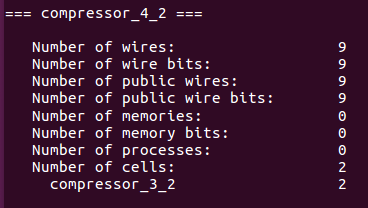

图68. compressor_4_2的子模块统计

由电路图及yosys统计结果，可得模块所用的各种基本门级电路的数量如表14所示，`compressor_4_2`子模块的总的资源代价为64。

表14. compressor_4_2模块门级资源用量统计

$$
\begin{array}{|c|c|c|}
\hline
{门}&{门数量}&{CMOS管数量}\\
\hline
{AND}&{0}&{0}\\
{OR}&{0}&{0}\\
{NOT}&{4}&{8}\\
{NAND}&{6}&{24}\\
{NOR}&{0}&{0}\\
{AOI4}&{4}&{32}\\
{XNOR}&{0}&{0}\\
{XOR}&{0}&{0}\\
\hline
{总计}&{14}&{64}\\
\hline
\end{array}
$$

对于`non_cin_compressor_4_2`模块，通过yosys分析其子模块构成，如图69所示，从图中可见，`non_cin_compressor_4_2`由1个`compressor_3_2`模块和一个半加器`half_adder`模块构成。

图69. non_cin_compressor_4_2子模块统计

`non_cin_compressor_4_2`的电路图如图70所示。

图70. non_cin_compressor_4_2子模块电路结构

对于子模块`half_adder`，其电路如图71所示。

图71. half_adder模块电路结构

可以得到半加器`half_adder`各类门的数量以及CMOS管数量如表15所示。

表15. half_adder子模块门级资源用量统计

$$
\begin{array}{|c|c|c|}
\hline
{门}&{门数量}&{CMOS管数量}\\
\hline
{AND}&{1}&{6}\\
{OR}&{0}&{0}\\
{NOT}&{0}&{0}\\
{NAND}&{0}&{0}\\
{NOR}&{2}&{8}\\
{AOI4}&{0}&{0}\\
{XNOR}&{0}&{0}\\
{XOR}&{0}&{0}\\
\hline
{总计}&{3}&{14}\\
\hline
\end{array}
$$

综合以上对子模块`half_adder`以及`compressor_3_2`的资源分析，`non_cin_compressor_4_2`模块分模块统计得到的CMOS数量如表16所示，可得`non_cin_compressor_4_2`的资源代价分为46。

表16. non_cin_compressor_4_2模块每个子模块资源统计

$$
\begin{array}{|c|c|c|c|}
\hline
{模块(门)}&{模块(门)数量}&{每个模块(门)的CMOS数量}&{CMOS总量}\\
\hline
{compressor\\_3\\_2}&{1}&{32}&{32}\\
{half\\_adder}&{1}&{14}&{14}\\
\hline
{总计}&{2}&{***}&{46}\\
\hline
\end{array}
$$

同样地，从门级结构的角度进行资源统计，统计结果如表17，CMOS数量统计值仍然是46与门级角度统计的结果一致，这比标准4:2压缩器模块`compressor_4_2`使用了更少的资源。

表17.non_cin_compressor_4_2子模块门级资源用量统计

$$
\begin{array}{|c|c|c|}
\hline
{门}&{门数量}&{CMOS管数量}\\
\hline
{AND}&{1}&{6}\\
{OR}&{0}&{0}\\
{NOT}&{2}&{4}\\
{NAND}&{3}&{12}\\
{NOR}&{2}&{8}\\
{AOI4}&{2}&{16}\\
{XNOR}&{0}&{0}\\
{XOR}&{0}&{0}\\
\hline
{总计}&{10}&{46}\\
\hline
\end{array}
$$

对于子模块`in_0_1_4_2`，其电路图如图72所示。

图72. in_0_1_4_2模块电路结构

由图72中的电路图，可以得到模块所用的各种基本门级电路的数量及“资源代价分”如表18所示，`in_0_1_4_2`子模块的总的资源代价为34，相比普通的4:2压缩模块`compressor_4_2`，CMSOS管数量减少了30。

表18. in_0_1_4_2模块门级资源用量统计

$$
\begin{array}{|c|c|c|}
\hline
{门}&{门数量}&{CMOS管数量}\\
\hline
{AND}&{0}&{0}\\
{OR}&{0}&{0}\\
{NOT}&{3}&{6}\\
{NAND}&{3}&{12}\\
{NOR}&{0}&{0}\\
{AOI4}&{2}&{16}\\
{XNOR}&{0}&{0}\\
{XOR}&{0}&{0}\\
\hline
{总计}&{8}&{34}\\
\hline
\end{array}
$$

对于模块`in_0_4_2`，其电路图如图73所示。

图73. in_0_4_2模块电路结构

通过yosys分析`in_0_4_2`模块的模块结构，如图74所示，从图中可见`in_0_4_2`由1个`compressor_3_2`子模块和1个`half_adder`子模块构成，这也符合图73中的电路结构。

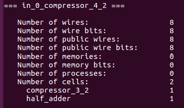

图74. in_0_4_2子模块统计

综合以上对子模块`half_adder`以及`compressor_3_2`的资源分析，`in_0_4_2`模块分模块统计得到的CMOS数量如表19所示，可得`in_0_4_2`的资源代价分为46。

表19. in_0_4_2模块每个子模块资源统计

$$
\begin{array}{|c|c|c|c|}
\hline
{模块(门)}&{模块(门)数量}&{每个模块(门)的CMOS数量}&{CMOS总量}\\
\hline
{compressor\\_3\\_2}&{1}&{32}&{32}\\
{half\\_adder}&{1}&{14}&{14}\\
\hline
{总计}&{2}&{***}&{46}\\
\hline
\end{array}
$$

同样地，从门级结构的角度进行资源统计，统计结果如表20，CMOS数量统计值是46与门级角度统计的结果一致，这比标准4:2压缩器模块`compressor_4_2`使用了更少的资源。

表20.in_0_4_2子模块门级资源用量统计

$$
\begin{array}{|c|c|c|}
\hline
{门}&{门数量}&{CMOS管数量}\\
\hline
{AND}&{1}&{6}\\
{OR}&{0}&{0}\\
{NOT}&{2}&{4}\\
{NAND}&{3}&{12}\\
{NOR}&{2}&{8}\\
{AOI4}&{2}&{16}\\
{XNOR}&{0}&{0}\\
{XOR}&{0}&{0}\\
\hline
{总计}&{10}&{46}\\
\hline
\end{array}
$$

对于子模块`in_1_4_2`，其电路图如图75所示。

图75. in_1_4_2模块电路结构

由图75中的电路图，可以得到模块所用的各种基本门级电路的数量及“资源代价分”如表21所示，`in_1_4_2`子模块的总的资源代价为34，相比普通的4:2压缩模块`compressor_4_2`，CMSOS管数量减少了30。

表21. in_1_4_2模块门级资源用量统计

$$
\begin{array}{|c|c|c|}
\hline
{门}&{门数量}&{CMOS管数量}\\
\hline
{AND}&{0}&{0}\\
{OR}&{1}&{6}\\
{NOT}&{2}&{4}\\
{NAND}&{5}&{20}\\
{NOR}&{0}&{0}\\
{AOI4}&{2}&{16}\\
{XNOR}&{0}&{0}\\
{XOR}&{0}&{0}\\
\hline
{总计}&{10}&{46}\\
\hline
\end{array}
$$

在符号编码时，使用了一个额外的非门产生符号位的取反，另外第一级部分积压缩过程中，两次压缩各使用一个非门，第二级压缩中，最高位使用2个异或门(XOR)产生。综合以上对子模块以及门电路资源的分析，结合yosys统计出来的模块数量，`booth2_pp_compressor`模块分模块统计得到的CMOS数量如表22所示，可得其资源代价分为3058。

表22. booth2_pp_compressor模块每个子模块资源统计

$$
\begin{array}{|c|c|c|c|}
\hline
{模块(门)}&{模块(门)数量}&{每个模块(门)的CMOS数量}&{CMOS总量}\\
\hline
{compressor\\_3\\_2}&{9}&{32}&{288}\\
{compressor\\_4\\_2}&{36}&{64}&{2304}\\
{half\\_adder}&{5}&{14}&{70}\\
{in\\_0\\_1\\_compressor\\_4\\_2}&{3}&{34}&{102}\\
{in\\_0\\_compressor\\_4\\_2}&{1}&{46}&{46}\\
{in\\_1\\_compressor\\_4\\_2}&{1}&{46}&{46}\\
{non\\_cin\_compressor\\_4\\_2}&{4}&{46}&{184}\\
{NOT}&{3}&{2}&{6}\\
{XOR}&{1}&{12}&{12}\\
\hline
{总计}&{63}&{***}&{3058}\\
\hline
\end{array}
$$

同样地，从门级结构的角度进行资源统计，统计结果如表23，统计的MOS管数量(资源代价分)也是3058。

表23. booth2_pp_compressor模块门级资源用量统计

$$
\begin{array}{|c|c|c|}
\hline
{门}&{门数量}&{CMOS管数量}\\
\hline
{AND}&{10}&{60}\\
{OR}&{1}&{6}\\
{NOT}&{186}&{372}\\
{NAND}&{272}&{1088}\\
{NOR}&{20}&{80}\\
{AOI4}&{180}&{1440}\\
{XNOR}&{0}&{0}\\
{XOR}&{1}&{12}\\
\hline
{总计}&{370}&{3058}\\
\hline
\end{array}
$$

###### 求和模块资源统计

通过yosys分析求和模块`adder_32`的子模块构成，如图76所示，可见求和模块包括26个3:2压缩器模块`compress_3_2`，3个半加器模块`half_adder`，而得到乘积结果的最高位需要额外使用2个异或门(XOR)。

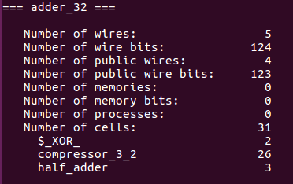

图76. adder_32子模块统计

综合以上对子模块`half_adder`以及`compressor_3_2`的资源分析，并结合yosys统计的子模块数量，`adder_32`模块分模块统计得到的CMOS数量如表24所示，可得`adder_32`的资源代价分为898。

表24. adder_32模块每个子模块资源统计

$$
\begin{array}{|c|c|c|c|}
\hline
{模块(门)}&{模块(门)数量}&{每个模块(门)的CMOS数量}&{CMOS总量}\\
\hline
{compressor\\_3\\_2}&{26}&{32}&{832}\\
{half\\_adder}&{3}&{14}&{42}\\
{XOR}&{2}&{12}&{24}\\
\hline
{总计}&{31}&{***}&{898}\\
\hline
\end{array}
$$

同样地，从门级结构的角度进行资源统计，统计结果如表25，CMOS数量统计值是898，与子模块角度统计的结果一致。

表25.adder_32模块门级资源用量统计

$$
\begin{array}{|c|c|c|}
\hline
{门}&{门数量}&{CMOS管数量}\\
\hline
{AND}&{3}&{18}\\
{OR}&{0}&{0}\\
{NOT}&{52}&{104}\\
{NAND}&{78}&{312}\\
{NOR}&{6}&{24}\\
{AOI4}&{52}&{416}\\
{XNOR}&{0}&{0}\\
{XOR}&{2}&{24}\\
\hline
{总计}&{193}&{898}\\
\hline
\end{array}
$$

##### 顶层模块资源分析

通过上一节对`booth2_pp_gen`、`booth2_pp_compressor`以及`adder32`的资源统计，结合前文中给出的yosys统计的结果，这三个子模块分别使用一个，顶层模块`HIS_MULT_TOP`分模块统计得到的CMOS数量如表26所示，可得本设计的资源代价分为6530。

表26. 顶层模块每个子模块资源统计

$$
\begin{array}{|c|c|c|c|}
\hline
{模块(门)}&{模块(门)数量}&{每个模块(门)的CMOS数量}&{CMOS总量}\\
\hline
{booth2\\_pp\\_gen}&{1}&{2574}&{2574}\\
{booth2\\_pp\\_compressor}&{1}&{3058}&{3058}\\
{adder\\_32}&{1}&{898}&{898}\\
\hline
{总计}&{3}&{***}&{6530}\\
\hline
\end{array}
$$

从门级结构的角度进行资源统计，统计结果如表27，CMOS数量统计值是6530，与子模块角度统计的结果一致。

表27.adder_32模块门级资源用量统计

$$
\begin{array}{|c|c|c|}
\hline
{门}&{门数量}&{CMOS管数量}\\
\hline
{AND}&{33}&{198}\\
{OR}&{16}&{96}\\
{NOT}&{254}&{508}\\
{NAND}&{367}&{1468}\\
{NOR}&{64}&{256}\\
{AOI4}&{496}&{3968}\\
{XNOR}&{0}&{0}\\
{XOR}&{3}&{36}\\
\hline
{总计}&{1233}&{6530}\\
\hline
\end{array}
$$

#### 性能统计

根据赛题给定的各个门级电路的性能代价，计算出本设计的关键路径的性能代价分为470。

通过分析本设计各个子模块的端到端的“性能代价长度”，并依据电路整体结构统计了部分积生成模块相对于输入端的“性能代价长度”。接着利用excel表格公式的MAX函数，依据压缩模块和求和模块的电路结构，统计出每一个模块端口相对于顶层模块输入端得“性能代价长度”，并得到最终的最长的性能代价，这一值即为最终的“性能代价分”，性能统计的excel表格在本工程所附的附件中。

###### 部分积生成模块端到端性能统计

由前文描述可知，对于PP2-PP8的生成，部分积生成模块的电路结构如图77所示。

图77. 部分积PP2-PP7生成模块

由图可见，对于该电路生成的部分积`PP`的每一个比特位，其相对于输入的关键路径并不相同，以PP[12]为例，其相对于输入端的关键路径如图78所示，图中蓝色的器件即为关键路径串起来的路径，PP[12]上方的数字109代表其关键路径性能代价分。

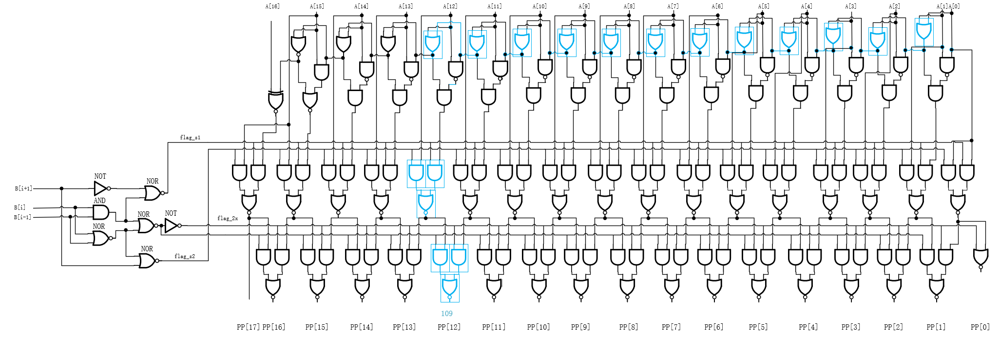

图78. PP[12]关键路径示意图

对`PP`的每一个比特位，都进行了关键路径统计，详细的关键路径示意图可见本工程所附的visio文件，各个比特位的关键路径统计结果如表28所示。

表28.部分积PP2-PP7生成过程每个比特位的关键路径性能代价

$$
\begin{array}{|c|c|}
\hline
{比特位}&{关键路径性能代价分}\\
\hline
{0}&{26}\\
{1}&{32}\\
{2}&{39}\\
{3}&{46}\\
{4}&{53}\\
{5}&{60}\\
{6}&{67}\\
{7}&{74}\\
{8}&{81}\\
{9}&{88}\\
{10}&{95}\\
{11}&{102}\\
{12}&{109}\\
{13}&{116}\\
{14}&{121}\\
{15}&{129}\\
{16}&{129}\\
{17}&{110}\\
\hline
\end{array}
$$

对于PP1的生成，部分积生成模块的电路结构如图79所示。

图79. 部分积PP1生成模块

由图可见，该电路与PP2-PP8的相应电路比较，booth编码器不一样，可能会影响相应的关键路径长度。以PP[1]为例，其相对于输入端的关键路径如图80所示，可见其性能代价分为22，而部分积PP2-PP8生成模块得到PP[1]的关键路径性能代价分为26，有所不同。当关键路径不经过booth编码电路时，两者关键路径相同。

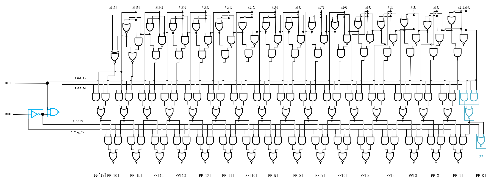

图80. 部分积PP1生成模块的PP[1]关键路径示意图

对`PP1`的每一个比特位，各个比特位的关键路径统计结果如表29所示。

表29.部分积PP1生成过程每个比特位的关键路径性能代价

$$
\begin{array}{|c|c|}
\hline
{比特位}&{关键路径性能代价分}\\
\hline
{0}&{22}\\
{1}&{32}\\
{2}&{39}\\
{3}&{46}\\
{4}&{53}\\
{5}&{60}\\
{6}&{67}\\
{7}&{74}\\
{8}&{81}\\
{9}&{88}\\
{10}&{95}\\
{11}&{102}\\
{12}&{109}\\
{13}&{116}\\
{14}&{121}\\
{15}&{129}\\
{16}&{129}\\
{17}&{110}\\
\hline
\end{array}
$$

###### 部分积压缩及求和模块性能统计

本设计中，压缩过程中每一个压缩器每个输入端相对于顶层输入端的关键路径并不相同，例如对于部分积`PP1`-`PP4`的压缩过程，其示意图如图81所示，图中位置索引为4处，使用的是3:2压缩器，其输入数据分别是PP1[4]，PP2[2]，PP3[0]，结合上一节分析，这三者的关键路径性能代价分分别是53、39、26，同理，对于其他各个模块，其输入的路径长度也都不相同。

图81. 第一级部分积PP1-PP4压缩过程示意图

本工作的统计方法如图82所示，通过统计出每个子模块的端到端路径长度 $P(path)$，这也是输入经过子模块后的路径长度增量，对特定的输出`o`，分析所有可能的输入路径`p1`、`p2`、`p3`等，在输入端口`i`代价分 $P(i)$的基础上，加上经过模块后的路径长度增量 $P(p1)$、 $P(p2)$、 $P(p3)$等，得到 $P(i)+P(p1)$、 $P(i)+P(p2)$、 $P(i)+P(p3)$等，求这些路径结果的最大值，即可得到输出端口`o`的性能代价 $P(o)$，通过对所有模块使用这一方法，即可得到模块内所有电路连线相对输入端口的关键路径代价分。

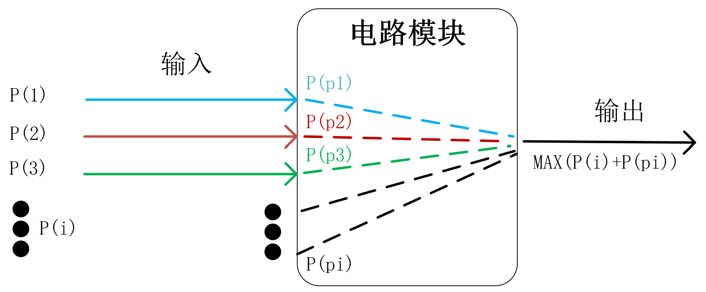

图82. 模块关键路径统计示意图

鉴于本设计压缩器及求和电路都由子模块`compressor_4_2`、`compressor_3_2`、`non_cin_compressor_4_2`、`in_1_compressor_4_2`、`in_0_compressor_4_2`、`in_0_1_compressor_4_2`、`half_adder`及少量非门(NOT)、异或门组成，现分析这些模块的端到端性能代价。

对于子模块`compressor_4_2`，其电路图如图83所示。

图83. compressor_4_2模块电路结构

依据电路，统计的端到端路径代价长度如表30所示。

表30. compressor_4_2路径代价长度

$$
\begin{array}{|c|c|c|c|c|}
\hline
{输入输出端口}&{i_0/i_1}&{i_2}&{i_3}&{c_i}\\
\hline
{s}&{68}&{51}&{34}&{17}\\
\hline
{c}&{61}&{44}&{21}&{10}\\
\hline
{co}&{27}&{10}&{无}&{无}\\
\hline
\end{array}
$$

对于子模块`compressor_3_2`，其电路图如图84所示。

图84. compressor_3_2模块电路结构

依据电路，统计的端到端路径代价长度如表31所示。

表31. compressor_3_2路径代价长度

$$
\begin{array}{|c|c|c|}
\hline
{输入输出端口}&{i_0/i_1}&{c_i}\\
\hline
{co}&{27}&{10}\\
\hline
{d}&{34}&{17}\\
\hline
\end{array}
$$

对于子模块`half_adder`，其电路图如图85所示。

图85. half_adder模块电路结构

依据电路，统计的端到端路径代价长度如表32所示。

表32. half_adder路径代价长度

$$
\begin{array}{|c|c|}
\hline
{输入输出端口}&{a/b}\\
\hline
{d}&{12}\\
\hline
{c}&{7}\\
\hline
\end{array}
$$

对于子模块`non_cin_4_2`，其电路图如图86所示。

图86. non_cin_4_2模块电路结构

依据电路，统计的端到端路径代价长度如表33所示。

表33. non_cin_4_2路径代价长度

$$
\begin{array}{|c|c|c|c|c|}
\hline
{输入输出端口}&{i_0/i_1}&{i_2}&{i_3}\\
\hline
{d}&{46}&{29}&{12}\\
\hline
{c}&{41}&{24}&{7}\\
\hline
{co}&{27}&{10}&{无}\\
\hline
\end{array}
$$

对于子模块`in_0_1_4_2`，其电路图如图87所示。

图87. in_0_1_4_2模块电路结构

依据电路，统计的端到端路径代价长度如表34所示。

表34. in_0_1_4_2路径代价长度

$$
\begin{array}{|c|c|c|c|c|}
\hline
{输入输出端口}&{i_0/i_1}&{i_2}&{i_3}\\
\hline
{d}&{37}&{34}&{17}\\
\hline
{c}&{30}&{27}&{10}\\
\hline
{co}&{0}&{无}&{无}\\
\hline
\end{array}
$$

对于子模块`in_1_4_2`，其电路图如图88所示。

图88. in_1_4_2模块电路结构

依据电路，统计的端到端路径代价长度如表35所示。

表35. in_1_4_2路径代价长度

$$
\begin{array}{|c|c|c|c|c|}
\hline
{输入输出端口}&{i_0/i_1}&{i_2}&{c_i}\\
\hline
{d}&{46}&{34}&{17}\\
\hline
{c}&{39}&{27}&{10}\\
\hline
{co}&{7}&{无}&{无}\\
\hline
\end{array}
$$

对于子模块`in_0_4_2`，其电路图如图89所示。

图89. in_0_4_2模块电路结构

依据电路，统计的端到端路径代价长度如表36所示。

表36. in_0_4_2路径代价长度

$$
\begin{array}{|c|c|c|c|c|}
\hline
{输入输出端口}&{i_1/i_2}&{i_3}&{c_i}\\
\hline
{d}&{46}&{34}&{17}\\
\hline
{c}&{39}&{27}&{10}\\
\hline
{co}&{7}&{无}&{无}\\
\hline
\end{array}
$$

得到以上各个子模块的端到端路径后，通过构建excel表格，利用excel公式根据电路结构统计统计对应的性能代价分，excel表格内有相关模块的说明，请查看工程所附excel表格。

最终统计得到的关键路径的性能代价分为470，通过分析其关键路径可知，这一代价分可以拆解为(28)式:

$$470=102+68 \times2+27+19 \times10+15 \tag{28}$$

其中:

- `102`是第一个部分积操作数的第11位`PP1[11]`的产生相对于输入端的路径长度，参考表29，为102。
- `68`是标准4:2压缩器输出端口`s`，相对于输入端口`i0/i1`的路径增量，参考表30，这一值为68。通过分析，两级压缩的关键路径都是4:2压缩器从`i0/i1`到`s`，故这一值乘以2。
- `27`是3:2压缩器输出端口`co`，相对于输入端口`i0/i1`的路径增量，参考表31，这一值为27。
- `10`是3:2压缩器输出端口`co`，相对于输入端口`ci`的路径增量，即单个模块进位链的路径增量，参考表31，这一值为10。分析可得，这一个进位链一共串联起19个3:2压缩器，故这一值乘以2。
- `15`是一个异或门的路径增量，最终得到乘积结果最高位的电路是两级级联的异或门，通过分析关键路径，将关键路径较长的连线直接连到第二级异或门的其中一个输入端口上，只需增加一级异或门的路径。

从门级分析的角度，本设计的关键路径所经过的各类门级数量路径总和如表37所示，可见统计结果也是470，统计正确。

表37. 关键路径所经过的各类门及性能代价分分析

$$
\begin{array}{|c|c|c|}
\hline
{门}&{门数量}&{性能代价分总和}\\
\hline
{AND}&{1}&{7}\\
{OR}&{11}&{77}\\
{NOT}&{9}&{27}\\
{NAND}&{49}&{245}\\
{NOR}&{0}&{0}\\
{AOI4}&{11}&{99}\\
{XNOR}&{0}&{0}\\
{XOR}&{1}&{15}\\
\hline
{总计}&{82}&{470}\\
\hline
\end{array}
$$

分析得到的关键路径示意图如图90所示，图中浅蓝色的门级电路代表关键路径。

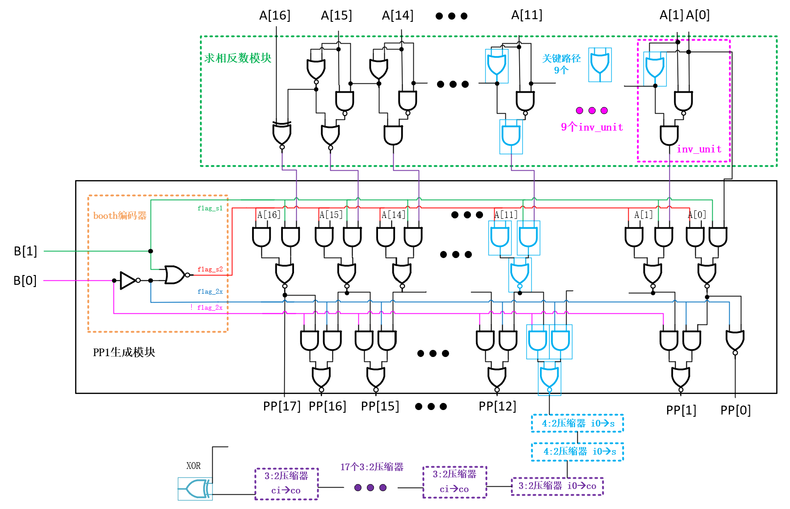

图90. 关键路径示意图

图90中，对于“4:2压缩器”从`i0`到`s`路径，展开为门级结构，如图91所示。

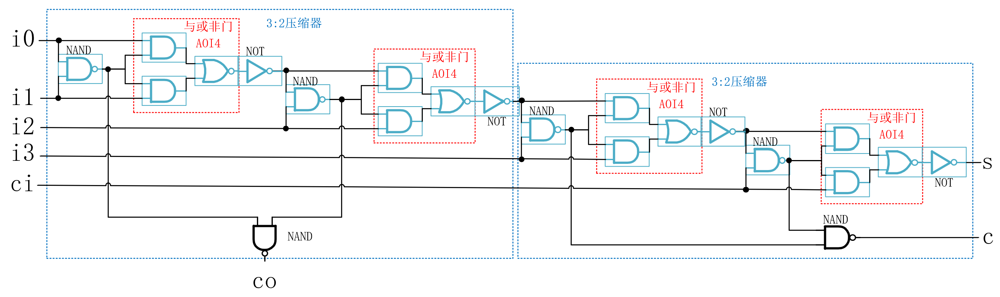

图91. 4:2压缩器从i0到s关键路径示意图

对于“3:2压缩器”从`i0`到`co`路径，展开为门级结构，如图92所示。

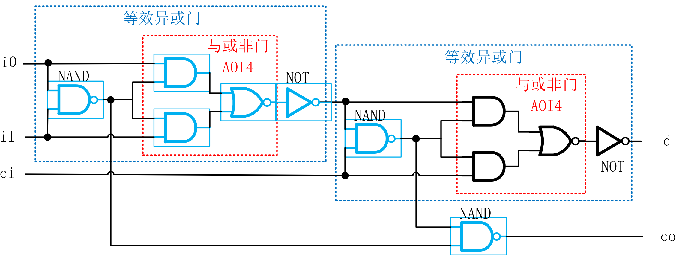

图92. 3:2压缩器从i0到co关键路径示意图

对于“3:2压缩器”从`ci`到`co`路径，展开为门级结构，如图93所示。

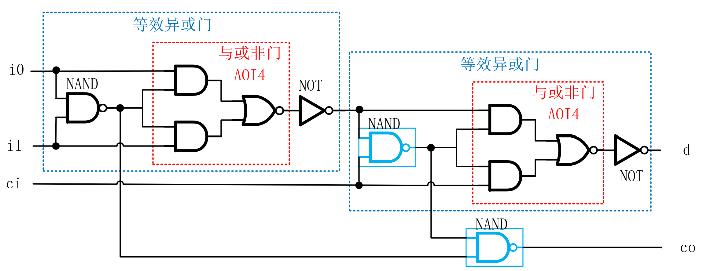

图93. 3:2压缩器从ci到co关键路径示意图

结合以上图形的分析，再次进行统计，得到的结果与表35中结果一致，说明本设计的关键路径为470。
